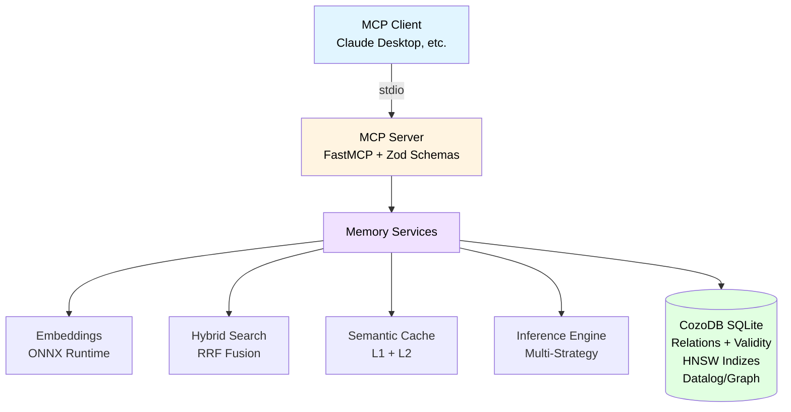

# CozoDB Memory MCP Server (Archiv/Referenz)

[](https://www.npmjs.com/package/cozo-memory)
[](https://nodejs.org)
[](LICENSE)

> **Hinweis:** Dieses Repository wird primär auf Englisch gepflegt. Die deutsche Dokumentation dient nur noch als Referenz und wird nicht mehr aktiv aktualisiert. Alle System-Komponenten (FTS, Keywords, Logs) sind nun auf Englisch optimiert.

**Local-first Memory für Claude & AI-Agenten mit Hybrid-Suche, Graph-RAG und Time-Travel – alles in einer einzigen Binary, kein Cloud, kein Docker.**

## Inhaltsverzeichnis

- [Installation](#installation)
- [Überblick](#überblick)
- [Positionierung & Vergleich](#positionierung--vergleich)
- [Performance & Benchmarks](#performance--benchmarks)
- [Architektur](#architektur-high-level)
- [Start / Integration](#start--integration)
- [Konfiguration & Backends](#konfiguration--backends)
- [Datenmodell](#datenmodell)
- [MCP Tools](#mcp-tools)
  - [mutate_memory (Schreiben)](#mutate_memory-schreiben)
  - [query_memory (Lesen)](#query_memory-lesen)
  - [analyze_graph (Analyse)](#analyze_graph-analyse)
  - [manage_system (Wartung)](#manage_system-wartung)
- [Production Monitoring](#production-monitoring)
- [Technische Highlights](#technische-highlights)
- [Optional: HTTP API Bridge](#optional-http-api-bridge)
- [Entwicklung](#entwicklung)
- [User Preference Profiling](#user-preference-profiling-mem0-style)
- [Troubleshooting](#troubleshooting)
- [Lizenz](#lizenz)

## Installation

### Via npm (Empfohlen)

```bash
# Global installieren
npm install -g cozo-memory

# Oder direkt mit npx nutzen (keine Installation nötig)
npx cozo-memory
```

### Aus dem Quellcode

```bash
git clone https://github.com/tobs-code/cozo-memory
cd cozo-memory
npm install && npm run build
npm run start
```

## Überblick

🔍 **Hybrid-Suche (seit v0.7)** - Kombination aus semantischer Suche (HNSW), Full-Text Search (FTS) und Graph-Signalen via Reciprocal Rank Fusion (RRF)

🔀 **Dynamic Fusion Framework (v2.3)** - Fortgeschrittenes 4-Pfad-Retrieval-System, das Dense Vector, Sparse Vector, FTS und Graph-Traversal mit konfigurierbaren Gewichten und Fusion-Strategien (RRF, Weighted Sum, Max, Adaptive) kombiniert

⏳ **Temporal Graph Neural Networks (v2.4)** - Zeitbewusste Node-Embeddings, die historischen Kontext, zeitliche Glätte und Recency-gewichtete Aggregation mittels Time2Vec-Encoding und Multi-Signal-Fusion erfassen

🔀 **Multi-Hop Reasoning mit Vector Pivots (v2.5)** - Logik-bewusste Retrieve-Reason-Prune-Pipeline, die Vector Search als Sprungbrett für Graph-Traversierung mit Helpfulness-Scoring und Pivot-Depth-Security nutzt

🕸️ **Graph-RAG & Graph-Walking (v1.7/v2.0)** - Hierarchisches Retrieval mit Community-Detection und Summarization; rekursive Traversals via optimierte Datalog-Algorithmen

🧠 **Agentic Retrieval Layer (v2.0)** - Auto-Routing Engine, die den Query-Intent via lokalem LLM analysiert, um die optimale Suchstrategie (Vector, Graph oder Community) zu wählen.

🧠 **Multi-Level Memory (v2.0)** - Kontext-bewusstes Memory-System mit integriertem Session- und Task-Management.

🎯 **Tiny Learned Reranker (v2.0)** - Integriertes Cross-Encoder Modell (`ms-marco-MiniLM-L-6-v2`) für ultra-präzises Re-Ranking der Top-Suchergebnisse.

🎯 **Multi-Vector Support (seit v1.7)** - Duale Embeddings pro Entity: Content-Embedding für Kontext, Name-Embedding für Identifikation

⚡ **Semantic Caching (seit v0.8.5)** - Zweistufiger Cache (L1 Memory + L2 Persistent) mit semantischem Query-Matching

⏱️ **Time-Travel-Abfragen** - Versionierung aller Änderungen via CozoDB Validity; Abfragen zu jedem Zeitpunkt

🔗 **Atomare Transaktionen (seit v1.2)** - Multi-Statement-Transaktionen für Datenkonsistenz

📊 **Graph-Algorithmen (seit v1.3/v1.6)** - PageRank, Betweenness Centrality, HITS, Community Detection, Shortest Path

🏗️ **Hierarchical GraphRAG (v2.0)** - Automatische Generierung thematischer "Community Summaries" mittels lokaler LLMs für globales "Big Picture" Reasoning.

🧹 **Janitor-Service** - LLM-gestützte automatische Bereinigung mit hierarchischer Summarization, Observation-Pruning und **automatischer Session-Komprimierung**.

🗜️ **Kontext-Kompaktierung & Auto-Summarization (v2.2)** - Automatische und manuelle Memory-Konsolidierung mit progressiver Summarization und LLM-gestützten Executive Summaries.

🧠 **Fact Lifecycle Management (v2.1)** - Natives „Soft-Deletion“ via CozoDB Validity Retraction; ungültige Fakten werden aus aktuellen Sichten ausgeblendet, bleiben aber in der Historie für Audits erhalten.

👤 **User Preference Profiling** - Persistente User-Präferenzen mit automatischem 50% Search-Boost

🔍 **Near-Duplicate Detection** - Automatische LSH-basierte Deduplizierung zur Vermeidung von Redundanz

🧠 **Inference Engine** - Implizite Wissensentdeckung mit mehreren Strategien

🏠 **100% Lokal** - Embeddings via ONNX/Transformers; keine externen Services erforderlich

📦 **Export/Import (seit v1.8)** - Export nach JSON, Markdown oder Obsidian-ready ZIP; Import von Mem0, MemGPT, Markdown oder nativem Format

📄 **PDF-Unterstützung (seit v1.9)** - Direkte PDF-Ingestion mit Textextraktion via pdfjs-dist; unterstützt Dateipfad und Content-Parameter

🕐 **Duales Zeitstempel-Format (seit v1.9)** - Alle Zeitstempel werden sowohl als Unix-Mikrosekunden als auch im ISO 8601 Format zurückgegeben

### Detaillierte Features

Dieses Repository enthält:
- einen MCP-Server (stdio) für Claude/andere MCP-Clients,
- einen optionalen HTTP-API-Bridge-Server für UI/Tools,

Wesentliche Eigenschaften:
- **Hybride Suche (v0.7 Optimized)**: Kombination aus semantischer Suche (HNSW), **Full-Text Search (FTS)** und Graph-Signalen, zusammengeführt via Reciprocal Rank Fusion (RRF).
- **Full-Text Search (FTS)**: Native CozoDB v0.7 FTS-Indizes mit **englischem** Stemming, Stopword-Filterung und robustem Query-Sanitizing (Bereinigung von `+ - * / \ ( ) ? .`) für maximale Stabilität.
- **Near-Duplicate Detection (LSH)**: Erkennt automatisch sehr ähnliche Beobachtungen via MinHash-LSH (CozoDB v0.7), um Redundanz zu vermeiden.
- **Recency Bias**: ältere Inhalte werden in der Fusion gedämpft (außer bei expliziter Keyword-Suche), damit „aktuell relevant“ häufiger oben landet.
- **Graph-RAG & Graph-Walking (v1.7 Optimized)**: Erweitertes Retrieval-Verfahren, das semantische Vektor-Seeds mit rekursiven Graph-Traversals kombiniert. Nutzt nun einen optimierten **Graph-Walking** Algorithmus via Datalog, der HNSW-Index-Lookups für präzise Distanzberechnungen während der Traversierung verwendet.
- **Multi-Vector Support (v1.7)**: Jede Entität verfügt nun über zwei spezialisierte Vektoren:
  1. **Content-Embedding**: Repräsentiert den inhaltlichen Kontext (Beobachtungen).
  2. **Name-Embedding**: Optimiert für die Identifikation via Namen/Label.
  Dies verbessert die Genauigkeit beim Einstieg in Graph-Walks signifikant.
- **Semantic & Persistent Caching (v0.8.5)**: Zweistufiges Caching-System:
  1. **L1 Memory Cache**: Ultraschneller In-Memory LRU-Cache (< 0.1ms).
  2. **L2 Persistent Cache**: Speicherung in CozoDB für Neustart-Resistenz.
  3. **Semantic Matching**: Erkennt semantisch ähnliche Queries via Vektor-Distanz.
  4. **Janitor TTL**: Automatische Bereinigung veralteter Cache-Einträge durch den Janitor-Service.
- **Time-Travel**: Änderungen werden über CozoDB `Validity` versioniert; historische Abfragen sind möglich.
- **JSON Merge Operator (++)**: Nutzt den v0.7 Merge-Operator für effiziente, atomare Metadaten-Updates.
- **Multi-Statement Transactions (v1.2)**: Unterstützt atomare Transaktionen über mehrere Operationen hinweg mittels CozoDB-Block-Syntax `{ ... }`. Dies garantiert, dass zusammenhängende Änderungen (z.B. Entity erstellen + Observation hinzufügen + Beziehung knüpfen) entweder vollständig oder gar nicht ausgeführt werden.
- **Graph-Metriken & Ranking Boost (v1.3 / v1.6)**: Integriert fortgeschrittene Graph-Algorithmen:
  - **PageRank**: Berechnet die "Wichtigkeit" von Wissensknoten für das Ranking.
  - **Betweenness Centrality**: Identifiziert zentrale Brückenelemente im Wissensnetzwerk.
  - **HITS (Hubs & Authorities)**: Unterscheidet zwischen Informationsquellen (Authorities) und Wegweisern (Hubs).
  - **Connected Components**: Erkennt isolierte Wissensinseln und Teilgraphen.
  - Diese Metriken werden automatisch in der Hybrid-Suche (`advancedSearch`) und im `graphRag` genutzt.
- **Native CozoDB Operatoren (v1.5)**: Verwendet nun explizite `:insert`, `:update` und `:delete` Operatoren anstelle von generischen `:put` (upsert) Aufrufen. Dies erhöht die Datensicherheit durch strikte Validierung der Datenbankzustände (z. B. Fehler beim Versuch, eine existierende Entität erneut zu "inserten").
- **Advanced Time-Travel Analysis (v1.5)**: Erweiterung der Beziehungs-Historie um Zeitbereichs-Filter (`since`/`until`) und automatische Diff-Zusammenfassungen, um Veränderungen (Hinzufügungen/Entfernungen) über spezifische Zeiträume hinweg zu analysieren.
- **Graph-Features (v1.6)**: Native Integration von Shortest Path (Dijkstra) mit Pfad-Rekonstruktion, Community Detection (LabelPropagation) und fortgeschrittenen Zentralitätsmaßen.
- **Graph-Evolution**: Trackt die zeitliche Entwicklung von Beziehungen (z. B. Rollenwechsel von „Manager“ zu „Berater“) via CozoDB `Validity` Queries.
- **Bridge Discovery**: Identifiziert „Brücken-Entitäten“, die verschiedene Communities verbinden – ideal für kreatives Brainstorming.
- **Inference**: implizite Vorschläge und Kontext-Erweiterung (z. B. transitive Expertise-Regel).
- **Konflikterkennung (Application-Level & Triggers)**: Erkennt automatisch Widersprüche in den Metadaten (z. B. „aktiv“ vs. „eingestellt“ / `archived: true`). Nutzt eine robuste Logik in der App-Schicht, um Datenintegrität vor dem Schreiben sicherzustellen.
- **Datenintegrität (Trigger-Konzept)**: Verhindert ungültige Zustände wie Selbst-Referenzen in Beziehungen (Self-Loops) direkt bei der Erstellung.
- **Hierarchische Summarization**: Der Janitor verdichtet alte Fragmente zu „Executive Summary“-Knoten, um das „Big Picture“ langfristig zu erhalten.
- **User Preference Profiling**: Eine spezialisierte `global_user_profile` Entität speichert persistente Präferenzen (Vorlieben, Arbeitsstil), die bei jeder Suche einen **50% Score-Boost** erhalten.
- **Fact Lifecycle Management (v2.1)**: Nutzt den nativen **Validity Retraction** Mechanismus von CozoDB. Anstatt Daten destruktiv zu löschen, werden Fakten durch einen `[timestamp, false]` Eintrag als ungültig markiert.
  1. **Revisionssicherheit**: Man kann jederzeit „zurück in der Zeit“ reisen, um zu sehen, was das System zu einem bestimmten Zeitpunkt wusste.
  2. **Konsistenz**: Alle Standard-Abfragen (Search, Graph-RAG, Inference) nutzen den `@ "NOW"` Filter, um zurückgezogene Fakten automatisch auszuschließen.
  3. **Atomare Retraction**: Ungültigkeitserklärungen können Teil einer Transaktion sein, was saubere Update-Pattern (altes ungültig machen + neues einfügen) ermöglicht.
- **Alles lokal**: Embeddings via Transformers/ONNX; kein externer Embedding-Dienst nötig.

## Positionierung & Vergleich

Die meisten "Memory"-MCP-Server lassen sich in zwei Kategorien einteilen:
1.  **Simple Knowledge-Graphs**: CRUD-Operationen auf Tripeln, oft nur Textsuche.
2.  **Reine Vector-Stores**: Semantische Suche (RAG), aber wenig Verständnis für komplexe Beziehungen.

Dieser Server füllt die Lücke dazwischen ("Sweet Spot"): Eine **lokale, datenbankgestützte Memory-Engine**, die Vektor-, Graph- und Keyword-Signale kombiniert.

### Vergleich mit anderen Lösungen

| Feature | **CozoDB Memory (Dieses Projekt)** | **Official Reference (`@modelcontextprotocol/server-memory`)** | **mcp-memory-service (Community)** | **Datenbank-Adapter (Qdrant/Neo4j)** |
| :--- | :--- | :--- | :--- | :--- |
| **Backend** | **CozoDB** (Graph + Vektor + Relational) | JSON-Datei (`memory.jsonl`) | SQLite / Cloudflare | Spezialisierte DB (nur Vektor o. Graph) |
| **Such-Logik** | **Agentisch (Auto-Route)**: Hybrid + Graph + Summaries | Nur Keyword / Exakter Graph-Match | Vektor + Keyword | Meist nur eine Dimension |
| **Inference** | **Ja**: Eingebaute Engine für implizites Wissen | Nein | Nein ("Dreaming" ist Konsolidierung) | Nein (nur Retrieval) |
| **Community** | **Ja**: Hierarchische Community Summaries | Nein | Nein | Nur Clustering (keine Summary) |
| **Time-Travel** | **Ja**: Abfragen zu jedem Zeitpunkt (`Validity`) | Nein (nur aktueller Stand) | Historie vorhanden, kein natives DB-Feature | Nein |
| **Wartung** | **Janitor**: LLM-gestützte Bereinigung | Manuell | Automatische Konsolidierung | Meist manuell |
| **Deployment** | **Lokal** (Node.js + Embedded DB) | Lokal (Docker/NPX) | Lokal oder Cloud | Benötigt oft externen DB-Server |

Der Kernvorteil ist **Intelligenz und Nachvollziehbarkeit**: Durch die Kombination eines **Agentic Retrieval Layers** mit **Hierarchical GraphRAG** kann das System sowohl spezifische Faktenfragen als auch breite thematische Abfragen mit viel höherer Präzision beantworten als reine Vektor-Stores.

## Performance & Benchmarks

Benchmarks auf einem Standard-Entwickler-Laptop (Windows, Node.js 20+, nur CPU):

| Metrik | Wert | Anmerkung |
| :--- | :--- | :--- |
| **Graph-Walking (Rekursiv)** | **~130 ms** | Vektor-Seed + Rekursive Datalog-Traversierung |
| **Graph-RAG (Breadth-First)** | **~335 ms** | Vektor-Seeds + 2-Hop Expansion |
| **Hybrid Search (Cache Hit)** | **< 0.1 ms** | **v0.8+ Semantic Cache** |
| **Hybrid Search (Kalt)** | **~35 ms** | FTS + HNSW + RRF-Fusion |
| **Vektor-Suche (Raw)** | **~51 ms** | Reine semantische Suche als Referenz |
| **FTS-Suche (Raw)** | **~12 ms** | Native Full-Text Search Performance |
| **Ingestion** | **~102 ms** | Pro Op (Schreiben + Embedding + FTS/LSH Indexing) |
| **RAM-Verbrauch** | **~1.7 GB** | Primär durch lokales `Xenova/bge-m3` modell |

### Benchmarks ausführen

Du kannst die Performance auf deinem System mit dem integrierten Benchmark-Tool testen:

```bash
npm run benchmark
```

Dieses Tool (`src/benchmark.ts`) führt folgende Tests durch:
1.  **Initialisierung**: Kaltstart-Dauer des Servers inkl. Modell-Loading.
2.  **Ingestion**: Massen-Import von Test-Entitäten und Beobachtungen (Durchsatz).
3.  **Search Performance**: Latenz-Messung für Hybrid Search vs. Raw Vector Search.
4.  **RRF Overhead**: Ermittlung der zusätzlichen Rechenzeit für die Fusion-Logik.
 
### Evaluations-Suite ausführen (RAG-Qualität)
Um die Qualität und den Recall der verschiedenen Retrieval-Strategien (Suche vs. Graph-RAG vs. Graph-Walking) zu bewerten, nutzen Sie die Evaluations-Suite:
 
```bash
npm run eval
 ```
 
Dieses Tool vergleicht die Strategien anhand eines synthetischen Datensatzes und misst **Recall@K**, **MRR** und **Latenz**.
 
| Methode | Recall@10 | Avg Latenz | Bestens geeignet für |
| :--- | :--- | :--- | :--- |
| **Graph-RAG** | **1.00** | **~32 ms** | Tiefes relationales Reasoning |
| **Graph-RAG (Reranked)** | **1.00** | **~36 ms** | Maximale Präzision für relationale Daten |
| **Graph-Walking** | 1.00 | ~50 ms | Assoziative Pfad-Exploration |
| **Hybrid-Suche** | 1.00 | ~89 ms | Breite Fakten-Abfrage |
| **Reranked Search** | 1.00 | ~20 ms* | Ultra-präzise Faktensuche (Warm Cache) |

## Architektur (high level)



### Graph-Walking Visualisierung


## Installation

### Voraussetzungen
- Node.js 20+ (empfohlen)
- Die CozoDB Native Dependency wird via `cozo-node` installiert.

### Setup

```bash
npm install
npm run build
```

### Windows Quickstart

```bash
npm install
npm run build
npm run start
```

Hinweise:
- Beim ersten Start lädt `@xenova/transformers` das Embedding-Modell (kann dauern).
- Die Embeddings werden auf der CPU verarbeitet.

## Start / Integration

### MCP Server (stdio)

Der MCP Server läuft über stdio (für Claude Desktop & Co.). Start:

```bash
npm run start
```

Standard-Datenbankpfad: `memory_db.cozo.db` im Projektroot (wird automatisch angelegt).

### Claude Desktop Integration

```json
{
  "mcpServers": {
    "cozo-memory": {
      "command": "node",
      "args": ["C:/Pfad/zu/cozo-memory/dist/index.js"]
    }
  }
}
```

### CLI-Tool

CozoDB Memory enthält ein vollwertiges CLI für alle Operationen:

```bash
# System-Operationen
cozo-memory system health
cozo-memory system metrics
cozo-memory system reflect

# Entitäts-Operationen
cozo-memory entity create -n "MyEntity" -t "person" -m '{"age": 30}'
cozo-memory entity get -i <entity-id>
cozo-memory entity delete -i <entity-id>

# Beobachtungen (Observations)
cozo-memory observation add -i <entity-id> -t "Notiz"

# Beziehungen (Relations)
cozo-memory relation create --from <id1> --to <id2> --type "knows" -s 0.8

# Suche
cozo-memory search query -q "Suchbegriff" -l 10
cozo-memory search context -q "Kontext-Abfrage"
cozo-memory search agentic -q "Agentic-Suche"

# Graph-Operationen
cozo-memory graph explore -s <entity-id> -h 3
cozo-memory graph pagerank
cozo-memory graph communities
cozo-memory graph summarize

# Session- & Task-Management
cozo-memory session start -n "Meine Session"
cozo-memory session stop -i <session-id>
cozo-memory task start -n "Mein Task" -s <session-id>
cozo-memory task stop -i <task-id>

# Export/Import
cozo-memory export json -o backup.json --include-metadata --include-relationships --include-observations
cozo-memory export markdown -o notes.md
cozo-memory export obsidian -o vault.zip
cozo-memory import file -i data.json -f cozo

# Alle Befehle unterstützen -f json oder -f pretty für die Formatierung
```

## Konfiguration & Backends

Das System unterstützt verschiedene Speicher-Backends. Standardmäßig wird **SQLite** verwendet, da es keine zusätzliche Installation erfordert und für die meisten Anwendungsfälle die beste Balance aus Performance und Einfachheit bietet.

### Backend wechseln (z. B. zu RocksDB)

RocksDB bietet Vorteile bei sehr großen Datensätzen (Millionen von Einträgen) und schreibintensiven Workloads durch bessere Parallelität und Datenkompression.

Um das Backend zu wechseln, setzen Sie die Umgebungsvariable `DB_ENGINE` vor dem Start:

**PowerShell:**
```powershell
$env:DB_ENGINE="rocksdb"; npm run dev
```

**Bash:**
```bash
DB_ENGINE=rocksdb npm run dev
```

| Backend | Status | Empfehlung |
| :--- | :--- | :--- |
| **SQLite** | Aktiv (Standard) | Standard für Desktop/lokale Nutzung. |
| **RocksDB** | Vorbereitet & Getestet | Für High-Performance oder sehr große Datenmengen. |
| **MDBX** | Nicht unterstützt | Erfordert manuellen Build von `cozo-node` aus dem Quellcode. |

---

## Datenmodell

CozoDB-Relations (vereinfacht) – alle Schreiboperationen erzeugen neue `Validity`-Einträge (Time-Travel):
- `entity`: `id`, `created_at: Validity` ⇒ `name`, `type`, `embedding(1024)`, `name_embedding(1024)`, `metadata(Json)`
- `observation`: `id`, `created_at: Validity` ⇒ `entity_id`, `text`, `embedding(1024)`, `metadata(Json)`
- `relationship`: `from_id`, `to_id`, `relation_type`, `created_at: Validity` ⇒ `strength(0..1)`, `metadata(Json)`
- `entity_community`: `entity_id` ⇒ `community_id` (Key-Value Mapping aus LabelPropagation)
- `memory_snapshot`: `snapshot_id` ⇒ Counts + `metadata` + `created_at(Int)`

## MCP Tools

Die Oberfläche ist auf **4 konsolidierte Tools** reduziert. Die konkrete Operation wird immer über `action` gewählt.

| Tool | Zweck | Wichtige Aktionen |
|------|-------|-------------------|
| `mutate_memory` | Schreiboperationen | create_entity, update_entity, delete_entity, add_observation, create_relation, run_transaction, add_inference_rule, ingest_file, invalidate_observation, invalidate_relation |
| `query_memory` | Leseoperationen | search, advancedSearch, context, entity_details, history, graph_rag, graph_walking, agentic_search |
| `analyze_graph` | Graph-Analyse | explore, communities, pagerank, betweenness, hits, shortest_path, bridge_discovery, semantic_walk, infer_relations |
| `manage_system` | Wartung | health, metrics, export_memory, import_memory, snapshot_create, snapshot_list, snapshot_diff, cleanup, defrag, reflect, summarize_communities, clear_memory, compact |

### mutate_memory (Schreiben)

Aktionen:
- `create_entity`: `{ name, type, metadata? }`
- `update_entity`: `{ id, name?, type?, metadata? }`
- `delete_entity`: `{ entity_id }`
- `add_observation`: `{ entity_id?, entity_name?, entity_type?, text, metadata? }`
- `create_relation`: `{ from_id, to_id, relation_type, strength?, metadata? }`
- `run_transaction`: `{ operations: Array<{ action, params }> }` **(Neu v1.2)**: Führt mehrere Operationen atomar aus.
- `add_inference_rule`: `{ name, datalog }`
- `ingest_file`: `{ format, file_path?, content?, entity_id?, entity_name?, entity_type?, chunking?, metadata?, observation_metadata?, deduplicate?, max_observations? }`
- `invalidate_observation`: `{ observation_id }` **(Neu v2.1)**: Zieht eine Observation mittels Validity `[now, false]` zurück.
- `invalidate_relation`: `{ from_id, to_id, relation_type }` **(Neu v2.1)**: Zieht eine Beziehung mittels Validity `[now, false]` zurück.
  - `format` Optionen: `"markdown"`, `"json"`, `"pdf"` **(Neu v1.9)**
  - `file_path`: Optionaler Pfad zur Datei auf der Festplatte (Alternative zum `content` Parameter)
  - `content`: Dateiinhalt als String (erforderlich wenn `file_path` nicht angegeben)
  - `chunking` Optionen: `"none"`, `"paragraphs"` (zukünftig: `"semantic"`)

Wichtige Details:
- `run_transaction` unterstützt `create_entity`, `add_observation` und `create_relation`. Parameter werden automatisch suffigiert, um Kollisionen zu vermeiden.
- `create_relation` lehnt Selbst-Referenzen (`from_id === to_id`) ab.
- `strength` ist optional und defaultet auf `1.0`.
- `add_observation` liefert zusätzlich `inferred_suggestions` (Vorschläge aus der Inference Engine).
- `add_observation` macht Deduplication (exakt + semantisch via LSH). Bei Duplikaten kommt `status: "duplicate_detected"` mit `existing_observation_id` und einer geschätzten `similarity`.
- `update_entity` nutzt den JSON-Merge Operator `++` (v0.7), um bestehende Metadaten mit den neuen Werten zu vereinen, anstatt sie zu überschreiben.
- `add_inference_rule` validiert den Datalog-Code beim Speichern. Ungültige Syntax oder fehlende Pflichtspalten führen zu einem Fehler.

Beispiele:

```json
{ "action": "create_entity", "name": "Alice", "type": "Person", "metadata": { "role": "Dev" } }
```

```json
{ "action": "add_observation", "entity_id": "ENTITY_ID", "text": "Alice arbeitet am Feature-Flag-System." }
```

Beispiel (Duplikat):

```json
{ "action": "add_observation", "entity_id": "ENTITY_ID", "text": "Alice arbeitet am Feature-Flag-System." }
```

```json
{ "status": "duplicate_detected", "existing_observation_id": "OBS_ID", "similarity": 1 }
```

```json
{ "action": "create_relation", "from_id": "ALICE_ID", "to_id": "PROJ_ID", "relation_type": "works_on", "strength": 1.0 }
```

Custom Datalog Regeln (Inference):

- Inferenzregeln werden als `action: "add_inference_rule"` gespeichert.
- Die Datalog-Query muss ein Resultset mit **genau diesen 5 Spalten** liefern: `from_id, to_id, relation_type, confidence, reason`.
- `$id` ist der Platzhalter für die Entity-ID, für die die Inferenz gestartet wird.
- Tabellen im Schema:
    - `*entity{id, name, type, metadata, @ "NOW"}`
    - `*relationship{from_id, to_id, relation_type, strength, metadata, @ "NOW"}`
    - `*observation{id, entity_id, text, metadata, @ "NOW"}`

Beispiel (Transitiver Manager ⇒ Ober-Manager):

```json
{
  "action": "add_inference_rule",
  "name": "ober_manager",
  "datalog": "?[from_id, to_id, relation_type, confidence, reason] :=\n  *relationship{from_id: $id, to_id: mid, relation_type: \"manager_of\", @ \"NOW\"},\n  *relationship{from_id: mid, to_id: target, relation_type: \"manager_of\", @ \"NOW\"},\n  from_id = $id,\n  to_id = target,\n  relation_type = \"ober_manager_von\",\n  confidence = 0.6,\n  reason = \"Transitiver Manager-Pfad gefunden\""
}
```

Beispiel (Reziproke Beziehung vorschlagen):

```json
{
  "action": "add_inference_rule",
  "name": "colleague_symmetry",
  "datalog": "?[from_id, to_id, relation_type, confidence, reason] :=\n  *relationship{from_id: other, to_id: $id, relation_type: \"colleague_of\", @ \"NOW\"},\n  from_id = $id,\n  to_id = other,\n  relation_type = \"colleague_of\",\n  confidence = 0.9,\n  reason = \"Symmetrische Kollegenbeziehung\""
}
```

Regeln testen (liefert Vorschläge, persistiert sie aber nicht automatisch):

```json
{ "action": "infer_relations", "entity_id": "ENTITY_ID" }
```

Bulk-Ingestion (Markdown/JSON/PDF):

```json
{
  "action": "ingest_file",
  "entity_name": "Projektdokumentation",
  "format": "markdown",
  "chunking": "paragraphs",
  "content": "# Titel\n\nAbschnitt 1...\n\nAbschnitt 2...",
  "deduplicate": true,
  "max_observations": 50
}
```

PDF-Ingestion über Dateipfad:

```json
{
  "action": "ingest_file",
  "entity_name": "Forschungsarbeit",
  "format": "pdf",
  "file_path": "/pfad/zur/dokument.pdf",
  "chunking": "paragraphs",
  "deduplicate": true
}
```

### query_memory (Lesen)

Aktionen:
- `search`: `{ query, limit?, entity_types?, include_entities?, include_observations?, rerank? }`
- `advancedSearch`: `{ query, limit?, filters?, graphConstraints?, vectorOptions?, rerank? }`
- `context`: `{ query, context_window?, time_range_hours? }`
- `entity_details`: `{ entity_id, as_of? }`
- `history`: `{ entity_id }`
- `graph_rag`: `{ query, max_depth?, limit?, filters?, rerank? }` Graph-basiertes Reasoning. Findet erst Vektor-Seeds (mit Inline-Filtering) und expandiert dann transitive Beziehungen. Nutzt rekursives Datalog für effiziente BFS-Expansion.
- `graph_walking`: `{ query, start_entity_id?, max_depth?, limit? }` (v1.7) Rekursive semantische Graph-Suche. Startet bei Vektor-Seeds oder einer spezifischen Entität und folgt Beziehungen zu anderen semantisch relevanten Entitäten. Ideal für tiefere Pfad-Exploration.
- `agentic_search`: `{ query, limit?, rerank? }` **(Neu v2.0)**: **Auto-Routing Suche**. Nutzt ein lokales LLM (Ollama), um den Query-Intent zu analysieren und routet die Anfrage automatisch zur am besten geeigneten Strategie (`vector_search`, `graph_walk`, oder `community_summary`).
- `dynamic_fusion`: `{ query, config?, limit? }` **(Neu v2.3)**: **Dynamic Fusion Framework**. Kombiniert 4 Retrieval-Pfade (Dense Vector, Sparse Vector, FTS, Graph) mit konfigurierbaren Gewichten und Fusion-Strategien. Inspiriert von Allan-Poe (arXiv:2511.00855).
- `get_relation_evolution`: `{ from_id, to_id?, since?, until? }` (in `analyze_graph`) Zeigt die zeitliche Entwicklung von Beziehungen inklusive Zeitbereichs-Filter und Diff-Zusammenfassung.

Wichtige Details:
- `advancedSearch` erlaubt präzise Filterung:
    - `filters.entityTypes`: Liste von Entitätstypen.
    - `filters.metadata`: Key-Value Map für exakte Metadaten-Treffer.
    - `graphConstraints.requiredRelations`: Nur Entitäten, die bestimmte Beziehungen haben.
    - `graphConstraints.targetEntityIds`: Nur Entitäten, die mit diesen Ziel-IDs verbunden sind.
- `context` liefert ein JSON-Objekt mit Entities, Observations, Graph-Verbindungen und Inferenz-Vorschlägen.
- `search` nutzt RRF (Reciprocal Rank Fusion), um Vektor- und Keyword-Signale zu mischen.
- `graph_rag` kombiniert Vektor-Suche mit graph-basierten Traversals (Standard-Tiefe 2) für "strukturiertes Reasoning". Die Expansion erfolgt bidirektional über alle Beziehungstypen.
- **User Profiling**: Ergebnisse, die mit der `global_user_profile` Entität verknüpft sind, werden automatisch bevorzugt (Boost).
- `time_range_hours` filtert die Ergebnis-Kandidaten im Zeitfenster (in Stunden, kann float sein).
- `as_of` akzeptiert ISO-Strings oder `"NOW"`; invalides Format führt zu einem Fehler.
- Bei erkannten Status-Widersprüchen wird optional `conflict_flag` an Entities/Observations angehängt; `context` liefert zusätzlich `conflict_flags` als Zusammenfassung.

Beispiele:

```json
{ "action": "search", "query": "Feature Flag", "limit": 10 }
```

```json
{ 
  "action": "advancedSearch", 
  "query": "Manager", 
  "filters": { "metadata": { "role": "Lead" } },
  "graphConstraints": { "requiredRelations": ["works_with"] }
}
```

```json
{ "action": "graph_rag", "query": "Woran arbeitet Alice?", "max_depth": 2 }
```

```json
{ "action": "context", "query": "Woran arbeitet Alice gerade?", "context_window": 20 }
```

```json
{ "action": "context", "query": "Woran arbeitet Alice gerade?", "context_window": 20, "time_range_hours": 24 }
```

```json
{ "action": "entity_details", "entity_id": "ENTITY_ID", "as_of": "2026-02-01T12:00:00Z" }
```

#### Dynamic Fusion Framework (v2.3)

Das Dynamic Fusion Framework kombiniert 4 Retrieval-Pfade mit konfigurierbaren Gewichten und Fusion-Strategien:

**Retrieval-Pfade:**
1. **Dense Vector Search (HNSW)**: Semantische Ähnlichkeit via Embeddings
2. **Sparse Vector Search**: Keyword-basiertes Matching mit TF-IDF Scoring
3. **Full-Text Search (FTS)**: BM25 Scoring auf Entity-Namen
4. **Graph Traversal**: Multi-Hop Beziehungsexpansion von Vektor-Seeds

**Fusion-Strategien:**
- `rrf` (Reciprocal Rank Fusion): Kombiniert Rankings mit positionsbasiertem Scoring
- `weighted_sum`: Direkte gewichtete Kombination von Scores
- `max`: Nimmt maximalen Score über alle Pfade
- `adaptive`: Query-abhängige Gewichtung (zukünftige Erweiterung)

**Konfigurations-Beispiel:**

```json
{
  "action": "dynamic_fusion",
  "query": "Datenbank mit Graph-Fähigkeiten",
  "limit": 10,
  "config": {
    "vector": {
      "enabled": true,
      "weight": 0.4,
      "topK": 20,
      "efSearch": 100
    },
    "sparse": {
      "enabled": true,
      "weight": 0.3,
      "topK": 20,
      "minScore": 0.1
    },
    "fts": {
      "enabled": true,
      "weight": 0.2,
      "topK": 20,
      "fuzzy": true
    },
    "graph": {
      "enabled": true,
      "weight": 0.1,
      "maxDepth": 2,
      "maxResults": 20,
      "relationTypes": ["related_to", "uses"]
    },
    "fusion": {
      "strategy": "rrf",
      "rrfK": 60,
      "minScore": 0.0,
      "deduplication": true
    }
  }
}
```

**Antwort enthält:**
- `results`: Fusionierte und gerankte Ergebnisse mit Pfad-Beitrags-Details
- `stats`: Performance-Metriken inklusive:
  - `totalResults`: Anzahl der Ergebnisse nach Fusion
  - `pathContributions`: Anzahl der Ergebnisse pro Pfad
  - `fusionTime`: Gesamte Ausführungszeit
  - `pathTimes`: Individuelle Ausführungszeiten pro Pfad

**Anwendungsfälle:**
- **Breite Exploration**: Alle Pfade aktiviert mit ausgewogenen Gewichten
- **Präzisions-Suche**: Hohes Vektor-Gewicht, niedriges Graph-Gewicht
- **Beziehungs-Entdeckung**: Hohes Graph-Gewicht mit spezifischen Beziehungstypen
- **Keyword-Matching**: Hohe Sparse/FTS-Gewichte für exakte Term-Übereinstimmung

```json

#### Konflikterkennung (Status)

Wenn es für eine Entity widersprüchliche Aussagen zum Status gibt, wird ein Konflikt markiert. Dabei berücksichtigt das System **temporale Konsistenz**:

- **Status-Widerspruch**: Eine Entity hat im **gleichen Kalenderjahr** sowohl den Status „aktiv“ als auch „inaktiv“.
- **Status-Änderung (Kein Konflikt)**: Wenn die Aussagen aus unterschiedlichen Jahren stammen (z.B. 2024 „eingestellt“, 2025 „aktiv“), wird dies als legitime Änderung interpretiert und **nicht** als Konflikt markiert.

Die Erkennung nutzt Regex-Matching auf Keywords wie:
- **Aktiv**: aktiv, läuft, ongoing, active, running, in betrieb, fortgesetzt, weiter geführt, nicht eingestellt.
- **Inaktiv**: eingestellt, abgebrochen, gestoppt, stillgelegt, geschlossen, shutdown, deprecated, archiviert, beendet, aufgegeben.

**Integration in API-Antworten:**
- `entities[i].conflict_flag` bzw. `observations[i].conflict_flag`: Flag direkt am Treffer.
- `conflict_flags`: Liste aller erkannten Konflikte im `context`- oder `search`-Result.

Beispiel für einen erkannten Konflikt (gleiches Jahr):

```json
{
  "entities": [
    {
      "id": "…",
      "name": "Projekt X",
      "type": "Project",
      "conflict_flag": {
        "entity_id": "…",
        "entity_name": "Projekt X",
        "entity_type": "Project",
        "kind": "status",
        "summary": "Konflikt: Es gibt widersprüchliche Infos zum Status von Projekt X im gleichen Zeitraum (2026).",
        "evidence": {
          "active": { "created_at": 1767225600000000, "year": 2026, "text": "Projekt X ist aktiv." },
          "inactive": { "created_at": 1769904000000000, "year": 2026, "text": "Projekt X ist gestoppt." }
        }
      }
    }
  ]
}
```

### analyze_graph (Analyse)

Aktionen:
- `explore`: `{ start_entity, end_entity?, max_hops?, relation_types? }`
    - mit `end_entity`: kürzester Pfad (BFS)
    - ohne `end_entity`: Nachbarschaft bis max. 5 Hops (aggregiert nach minimaler Hop-Anzahl)
- `communities`: `{}` berechnet Communities neu und schreibt `entity_community`
- `pagerank`: `{}` Berechnet PageRank-Scores für alle Entitäten.
- `betweenness`: `{}` Berechnet Betweenness Centrality (Zentralitätsmaß für Brückenelemente).
- `hits`: `{}` Berechnet HITS-Scores (Hubs & Authorities).
- `connected_components`: `{}` Identifiziert isolierte Teilgraphen.
- `shortest_path`: `{ start_entity, end_entity }` Berechnet den kürzesten Pfad via Dijkstra (inkl. Distanz und Pfad-Rekonstruktion).
- `bridge_discovery`: `{}` Sucht nach Entitäten, die als Brücken zwischen isolierten Communities fungieren (hohe Betweenness-Relevanz)
- `semantic_walk`: `{ start_entity, max_depth?, min_similarity? }` (v1.7) Rekursive semantische Graph-Suche. Startet bei einer Entität und folgt rekursiv Pfaden, die aus expliziten Beziehungen UND semantischer Ähnlichkeit (Vektor-Distanz) bestehen. Findet "assoziative Pfade" im Wissensgraphen.
- `hnsw_clusters`: `{}` Analysiert Cluster direkt auf dem HNSW-Graphen (Layer 0). Extrem schnell, da keine Vektorberechnungen nötig sind.
- `infer_relations`: `{ entity_id }` liefert Vorschläge aus mehreren Strategien
- `get_relation_evolution`: `{ from_id, to_id?, since?, until? }` zeigt die zeitliche Entwicklung von Beziehungen inklusive Zeitbereichs-Filter und Diff-Zusammenfassung.

Beispiele:

```json
{ "action": "shortest_path", "start_entity": "ID_A", "end_entity": "ID_B" }
```

```json
{ "action": "hits" }
```

```json
{ "action": "explore", "start_entity": "ENTITY_ID", "max_hops": 3 }
```

```json
{ "action": "get_relation_evolution", "from_id": "ALICE_ID", "to_id": "PROJECT_X_ID" }
```

```json
{ "action": "infer_relations", "entity_id": "ENTITY_ID" }
```

### manage_system (Wartung)

Aktionen:
- `health`: `{}` liefert DB-Counts + Embedding-Cache-Stats + Performance-Metriken.
- `metrics`: `{}` liefert detaillierte Operationszähler, Fehlerstatistiken und Performance-Daten.
- `export_memory`: `{ format, includeMetadata?, includeRelationships?, includeObservations?, entityTypes?, since? }` exportiert Memory in verschiedene Formate.
- `import_memory`: `{ data, sourceFormat, mergeStrategy?, defaultEntityType? }` importiert Memory aus externen Quellen.
- `snapshot_create`: `{ metadata? }`
- `snapshot_list`: `{}`
- `snapshot_diff`: `{ snapshot_id_a, snapshot_id_b }`
- `cleanup`: `{ confirm, older_than_days?, max_observations?, min_entity_degree?, model? }`
- `compact`: `{ session_id?, entity_id?, model? }` **(Neu v2.2)**: Manuelle Kontext-Kompaktierung. Unterstützt drei Modi:
  - **Session-Kompaktierung**: `{ session_id, model? }` - Fasst Session-Observations in 2-3 Bullet Points zusammen und speichert im User-Profil
  - **Entity-Kompaktierung**: `{ entity_id, model? }` - Komprimiert Entity-Observations bei Schwellenwert-Überschreitung, erstellt Executive Summary
  - **Globale Kompaktierung**: `{}` (keine Parameter) - Komprimiert alle Entities, die den Schwellenwert überschreiten (Standard: 20 Observations)
- `summarize_communities`: `{ model?, min_community_size? }` **(Neu v2.0)**: Triggert die **Hierarchical GraphRAG** Pipeline. Berechnet Communities neu, generiert thematische Zusammenfassungen via LLM und speichert diese als `CommunitySummary` Entitäten.
- `reflect`: `{ entity_id?, mode?, model? }` Analysiert Memory auf Widersprüche und neue Einsichten. Unterstützt die Modi `summary` (Standard) und `discovery` (autonome Beziehungs-Refinerung).
- `clear_memory`: `{ confirm }`

Janitor-Cleanup Details:
- `cleanup` unterstützt `dry_run`: bei `confirm: false` werden nur Kandidaten gelistet.
- Bei `confirm: true` wird der Janitor aktiv:
  - **Hierarchische Summarization**: Erkennt isolierte oder alte Beobachtungen, lässt sie von einer lokalen LLM (Ollama) zusammenfassen und erstellt einen neuen `ExecutiveSummary`-Knoten. Die alten Fragmente werden gelöscht, um Rauschen zu reduzieren, während das Wissen erhalten bleibt.

Kontext-Kompaktierung Details **(Neu v2.2)**:
- **Automatische Kompaktierung**: Wird automatisch ausgelöst, wenn Observations den Schwellenwert überschreiten (Standard: 20)
  - Läuft im Hintergrund während `addObservation`
  - Verwendet Lock-Mechanismus zur Vermeidung gleichzeitiger Kompaktierung
- **Manuelle Kompaktierung**: Verfügbar via `compact` Action in `manage_system`
  - **Session-Modus**: Fasst Session-Observations zusammen und speichert im `global_user_profile`
  - **Entity-Modus**: Komprimiert spezifische Entity mit anpassbarem Schwellenwert
  - **Globaler Modus**: Komprimiert alle Entities, die den Schwellenwert überschreiten
- **Progressive Summarization**: Neue Observations werden mit existierenden Executive Summaries gemergt statt einfach angehängt
- **LLM-Integration**: Verwendet Ollama (Standard-Modell: `demyagent-4b-i1:Q6_K`) für intelligente Zusammenfassung

**Vor Janitor:**
```
Entity: Projekt X
├─ Observation 1: "Gestartet in Q1" (90 Tage alt, isoliert)
├─ Observation 2: "Nutzt React" (85 Tage alt, isoliert)
├─ Observation 3: "Team von 5" (80 Tage alt, isoliert)
└─ Observation 4: "Deployed auf Staging" (75 Tage alt, isoliert)
```

**Nach Janitor:**
```
Entity: Projekt X
└─ ExecutiveSummary: "Projekt X ist eine React-basierte Anwendung, die in Q1 
   mit einem Team von 5 Entwicklern gestartet wurde und aktuell auf der 
   Staging-Umgebung deployed ist."
```

### Self-Improving Memory Loop (`reflect`)
`reflect` analysiert Beobachtungen einer Entität (oder der Top 5 aktivsten Entitäten), um Widersprüche, Muster oder zeitliche Entwicklungen zu finden.
- **Modi**:
  - `summary` (Standard): Erzeugt eine textuelle "Reflexive Einsicht" Beobachtung.
  - `discovery`: Sucht autonom nach potenziellen Beziehungen mittels Inference Engine und validiert diese via LLM. 
    - Hochkonfidente Links (>0,8) werden automatisch erstellt.
    - Mittelkonfidente Links (>0,5) werden als Vorschlag (Suggestions) zurückgegeben.
- Ergebnisse werden als neue Beobachtungen (bei `summary`) oder Beziehungen (bei `discovery`) mit dem Metadaten-Feld `{ "kind": "reflection" }` oder `{ "source": "reflection" }` persistiert.
- Der Text wird mit dem Präfix `Reflexive Einsicht: ` gespeichert.

Defaults: `older_than_days=30`, `max_observations=20`, `min_entity_degree=2`, `model="demyagent-4b-i1:Q6_K"`.

Export/Import Details:
- `export_memory` unterstützt drei Formate:
  - **JSON** (`format: "json"`): Natives Cozo-Format, vollständig re-importierbar mit allen Metadaten und Zeitstempeln.
  - **Markdown** (`format: "markdown"`): Menschenlesbares Dokument mit Entities, Observations und Relationships.
  - **Obsidian** (`format: "obsidian"`): ZIP-Archiv mit Wiki-Links `[[Entity]]`, YAML-Frontmatter, bereit für Obsidian-Vault.
- `import_memory` unterstützt vier Quellformate:
  - **Cozo** (`sourceFormat: "cozo"`): Import aus nativem JSON-Export.
  - **Mem0** (`sourceFormat: "mem0"`): Import aus Mem0-Format (user_id wird zu Entity).
  - **MemGPT** (`sourceFormat: "memgpt"`): Import aus MemGPT Archival/Recall Memory.
  - **Markdown** (`sourceFormat: "markdown"`): Parse Markdown-Abschnitte als Entities mit Observations.
- Merge-Strategien: `skip` (Standard, Duplikate überspringen), `overwrite` (Existierende ersetzen), `merge` (Metadaten kombinieren).
- Optionale Filter: `entityTypes` (Array), `since` (Unix-Timestamp in ms), `includeMetadata`, `includeRelationships`, `includeObservations`.

Beispiel Export:
```json
{
  "action": "export_memory",
  "format": "obsidian",
  "includeMetadata": true,
  "entityTypes": ["Person", "Project"]
}
```

Beispiel Import:
```json
{
  "action": "import_memory",
  "sourceFormat": "mem0",
  "data": "{\"user_id\": \"alice\", \"memories\": [...]}",
  "mergeStrategy": "skip"
}
```

Production Monitoring Details:
- `health` liefert umfassenden Systemstatus inklusive Entity/Observation/Relationship-Counts, Embedding-Cache-Statistiken und Performance-Metriken (letzte Operationszeit, durchschnittliche Operationszeit, Gesamtanzahl Operationen).
- `metrics` liefert detaillierte Betriebsmetriken:
  - **Operationszähler**: Trackt create_entity, update_entity, delete_entity, add_observation, create_relation, search und graph_operations.
  - **Fehlerstatistiken**: Gesamtfehler und Aufschlüsselung nach Operationstyp.
  - **Performance-Metriken**: Dauer der letzten Operation, durchschnittliche Operationsdauer und Gesamtanzahl ausgeführter Operationen.
- Delete-Operationen enthalten nun detailliertes Logging mit Verifikationsschritten und liefern Statistiken über gelöschte Daten (Observations, ausgehende/eingehende Relationen).

Beispiele:

```json
{ "action": "health" }
```

```json
{ "action": "reflect", "entity_id": "ENTITY_ID" }
```

```json
{ "action": "cleanup", "confirm": false, "older_than_days": 60, "max_observations": 25 }
```

**Memory Defragmentation (v2.3):**

```json
{ "action": "defrag", "confirm": false, "similarity_threshold": 0.95, "min_island_size": 3 }
```

Die `defrag` Action reorganisiert die Memory-Struktur durch:
1. **Duplikat-Erkennung**: Findet und merged near-duplicate Observations via Cosine-Similarity (Threshold 0.8-1.0, Standard 0.95)
2. **Insel-Verbindung**: Verbindet kleine Wissensinseln (≤3 Nodes) mit dem Hauptgraphen via semantische Brücken
3. **Orphan-Entfernung**: Löscht verwaiste Entities ohne Observations oder Relations

Mit `confirm: false` wird ein Dry-Run durchgeführt, der Kandidaten anzeigt ohne Änderungen vorzunehmen.

```json
{ "action": "snapshot_diff", "snapshot_id_a": "SNAP_A", "snapshot_id_b": "SNAP_B" }
```

```json
{ "action": "clear_memory", "confirm": true }
```

## Production Monitoring

Das System enthält umfassende Monitoring-Funktionen für Produktionsumgebungen:

### Metriken-Tracking

Alle Operationen werden automatisch mit detaillierten Metriken erfasst:
- Operationszähler nach Typ (create, update, delete, search, etc.)
- Fehler-Tracking mit Aufschlüsselung nach Operation
- Performance-Metriken (Latenz, Durchsatz)

### Health Endpoint

Die `health`-Aktion liefert Echtzeit-Systemstatus:
```json
{ "action": "health" }
```

Liefert:
- Datenbank-Counts (Entities, Observations, Relationships)
- Embedding-Cache-Statistiken (Hit-Rate, Größe)
- Performance-Metriken (letzte Operationszeit, Durchschnittszeit, Gesamtoperationen)

### Metrics Endpoint

Die `metrics`-Aktion liefert detaillierte Betriebsmetriken:
```json
{ "action": "metrics" }
```

Liefert:
- **operations**: Anzahl jedes Operationstyps
- **errors**: Gesamtfehler und Aufschlüsselung nach Operation
- **performance**: Dauer der letzten Operation, Durchschnittsdauer, Gesamtoperationen

### Erweiterte Delete-Operationen

Delete-Operationen enthalten umfassendes Logging und Verifikation:
- Detailliertes Schritt-für-Schritt-Logging mit `[Delete]`-Präfix
- Zählt zugehörige Daten vor dem Löschen
- Verifikation nach dem Löschen
- Liefert Statistiken: `{ deleted: { observations: N, outgoing_relations: N, incoming_relations: N } }`

Beispiel:
```json
{ "action": "delete_entity", "entity_id": "ENTITY_ID" }
```

Liefert Löschstatistiken, die genau zeigen, was entfernt wurde.

## Technische Highlights

### Duales Zeitstempel-Format (v1.9)

Alle Schreiboperationen (`create_entity`, `add_observation`, `create_relation`) geben Zeitstempel in beiden Formaten zurück:
- `created_at`: Unix-Mikrosekunden (natives CozoDB-Format, präzise für Berechnungen)
- `created_at_iso`: ISO 8601 String (menschenlesbar, z.B. `"2026-02-28T17:21:19.343Z"`)

Dieses duale Format bietet maximale Flexibilität - verwende Unix-Zeitstempel für Zeitberechnungen und Vergleiche, oder ISO-Strings für Anzeige und Logging.

Beispiel-Antwort:
```json
{
  "id": "...",
  "created_at": 1772299279343000,
  "created_at_iso": "2026-02-28T17:21:19.343Z",
  "status": "Entity created"
}
```

### Local ONNX Embeddings (Transformers)

Default-Modell: `Xenova/bge-m3` (1024 Dimensionen).

Die Embeddings werden auf der CPU verarbeitet, um maximale Kompatibilität zu gewährleisten. Sie werden in einem LRU-Cache gehalten (1000 Einträge, 1h TTL). Bei Embedding-Fehlern wird ein Nullvektor zurückgegeben, damit Tool-Aufrufe stabil bleiben.

### Tiny Learned Reranker (Cross-Encoder)

Für maximale Präzision integriert CozoDB Memory einen spezialisierten **Cross-Encoder Reranker** (Phase 2 RAG).

- **Modell**: `Xenova/ms-marco-MiniLM-L-6-v2` (Lokal via ONNX)
- **Mechanismus**: Nach dem initialen Hybrid-Retrieval werden die Top-Kandidaten (bis zu 30) durch den Cross-Encoder neu bewertet. Im Gegensatz zu Bi-Encodern (Vektoren) verarbeiten Cross-Encoder Query und Dokument simultan und erfassen so tiefere semantische Nuancen.
- **Latenz**: Minimaler Overhead (~4-6ms für Top 10 Kandidaten).
- **Unterstützte Tools**: Verfügbar als `rerank: true` Parameter in `search`, `advancedSearch`, `graph_rag` und `agentic_search`.

### Hybrid Search (Vector + Keyword + Graph + Inference) + RRF

Die Suche kombiniert:
- Vektor-Ähnlichkeit über HNSW Indizes (`~entity:semantic`, `~observation:semantic`)
- Keyword Matching via Regex (`regex_matches(...)`)
- Graph-Signal über PageRank (für zentrale Entities)
- Community Expansion: Entities aus der Community der Top Seeds werden mit einem Boost eingebracht
- Inference-Signal: probabilistische Kandidaten (z. B. `expert_in`) mit `confidence` als Score

Fusion: Reciprocal Rank Fusion (RRF) über Quellen `vector`, `keyword`, `graph`, `community`, `inference`.

Zeitlicher Decay (standardmäßig aktiv):
- Vor der RRF-Fusion werden Scores zeitbasiert gedämpft, basierend auf `created_at` (Validity).
- Halbwertszeit: 90 Tage (exponentieller Decay), mit Source-spezifischen Floors:
  - `keyword`: kein Decay (entspricht „explizit gesucht“)
  - `graph`/`community`: mindestens 0.6
  - `vector`: mindestens 0.2

Uncertainty/Transparenz:
- Inferenz-Kandidaten werden als `source: "inference"` markiert und liefern eine kurze Begründung (Unschärfe-Hinweis) im Ergebnis.
- Im `context`-Output wird für inferierte Entities zusätzlich ein `uncertainty_hint` mitgeliefert, damit ein LLM „harter Fakt“ vs. „Vermutung“ unterscheiden kann.

### Inference Engine

Inference nutzt mehrere Strategien (nicht persistierend):
- **Co-occurrence**: Entitätsnamen in Observation-Texten (`related_to`, confidence 0.7)
- **Semantische Nähe**: ähnliche Entities via HNSW (`similar_to`, bis max. 0.9)
- **Transitivität**: A→B und B→C (`potentially_related`, confidence 0.5)
- **Expertise-Regel**: `Person` + `works_on` + `uses_tech` ⇒ `expert_in` (confidence 0.7)
- **Query-Triggered Expertise**: Bei Suchanfragen mit Keywords wie `expert`, `skill`, `knowledge`, `competence` etc. wird automatisch eine dedizierte Expertensuche über das Graph-Netzwerk gestartet.

## Optional: HTTP API Bridge

### API Bridge

Für UI/Tools gibt es einen Express-Server, der den `MemoryServer` direkt einbettet.

Start:

```bash
npm run bridge
```

Konfiguration:
- Port über `PORT` (Default: `3001`)

Ausgewählte Endpoints (Prefix `/api`):
- `GET /entities`, `POST /entities`, `GET /entities/:id`, `DELETE /entities/:id`
- `POST /observations`
- `GET /search`, `GET /context`
- `GET /health`
- `GET /snapshots`, `POST /snapshots`

## Entwicklung

### Struktur
- `src/index.ts`: MCP-Server + Tool-Registrierung + Schema Setup
- `src/embedding-service.ts`: Embedding Pipeline + LRU Cache
- `src/hybrid-search.ts`: Suchstrategien + RRF + Community Expansion
- `src/inference-engine.ts`: Inference Strategien
- `src/api_bridge.ts`: Express API Bridge (für UI)

### Scripts (Root)
- `npm run build`: TypeScript Build
- `npm run dev`: ts-node Start des MCP Servers
- `npm run start`: Startet `dist/index.js` (stdio)
- `npm run bridge`: Build + Start der API Bridge (`dist/api_bridge.js`)
- `npm run benchmark`: Führt Performance-Tests durch

## User Preference Profiling (Mem0-Style)

Das System pflegt ein persistentes Profil über den Benutzer (Vorlieben, Abneigungen, Arbeitsstil) über die spezialisierte Entität `global_user_profile`.

- **Vorteil**: Personalisierung ohne manuelle Suche ("Ich weiß, dass du TypeScript bevorzugst").
- **Funktionsweise**: Alle Beobachtungen, die dieser Entität zugeordnet werden, erhalten bei Such- und Kontext-Anfragen einen signifikanten Boost.
- **Initialisierung**: Das Profil wird beim ersten Start automatisch angelegt.

### Manuelle Profil-Bearbeitung

Du kannst das User-Profil jetzt direkt mit dem `edit_user_profile` MCP-Tool bearbeiten:

```typescript
// Aktuelles Profil anzeigen
{ }

// Metadata aktualisieren
{ 
  metadata: { timezone: "Europe/Berlin", language: "de" } 
}

// Präferenzen hinzufügen
{ 
  observations: [
    { text: "Bevorzugt TypeScript gegenüber JavaScript" },
    { text: "Mag prägnante Dokumentation" }
  ]
}

// Präferenzen zurücksetzen
{ 
  clear_observations: true,
  observations: [{ text: "Neue Präferenz" }]
}

// Name und Typ aktualisieren
{ 
  name: "Entwickler-Profil", 
  type: "UserProfile" 
}
```

**Hinweis**: Du kannst weiterhin die implizite Methode über `mutate_memory` mit `action='add_observation'` und `entity_id='global_user_profile'` verwenden.

### Manuelle Tests

Es gibt verschiedene Test-Skripte für unterschiedliche Features:

```bash
# Testet Edge-Cases und Basis-Operationen
npx ts-node src/test-edge-cases.ts

# Testet Hybrid-Suche und Kontext-Retrieval
npx ts-node src/test-context.ts

# Testet die Memory-Reflexion (benötigt Ollama)
npx ts-node test-reflection.ts

# Testet das User Preference Profiling und den Search-Boost
npx ts-node test-user-pref.ts

# Testet die manuelle User-Profil-Bearbeitung
npx ts-node src/test-user-profile.ts
```

## Troubleshooting

### Häufige Probleme

**Erster Start dauert lange**
- Der Embedding-Model-Download dauert beim ersten Start 30-90 Sekunden (Transformers lädt ~500MB Artefakte)
- Dies ist normal und passiert nur einmal
- Nachfolgende Starts sind schnell (< 2 Sekunden)

**Cleanup/Reflect benötigt Ollama**
- Bei Verwendung von `cleanup` oder `reflect` Aktionen muss ein Ollama-Dienst lokal laufen
- Ollama installieren von https://ollama.ai
- Gewünschtes Modell pullen: `ollama pull demyagent-4b-i1:Q6_K` (oder bevorzugtes Modell)

**Windows-Spezifisch**
- Embeddings werden auf der CPU verarbeitet für maximale Kompatibilität
- RocksDB-Backend benötigt Visual C++ Redistributable bei Verwendung dieser Option

**Performance-Probleme**
- Erste Query nach Neustart ist langsamer (kalter Cache)
- `health` Aktion nutzen um Cache-Hit-Raten zu prüfen
- RocksDB-Backend erwägen für Datasets > 100k Entities

## Lizenz

Dieses Projekt ist unter der Apache-2.0 Lizenz lizenziert. Siehe die [LICENSE](LICENSE) Datei für Details.

## Haftungsausschluss

Single-User, Local-First: Dieses Projekt wurde entwickelt, um auf einem einzelnen Benutzer und einer lokalen Installation zu funktionieren.