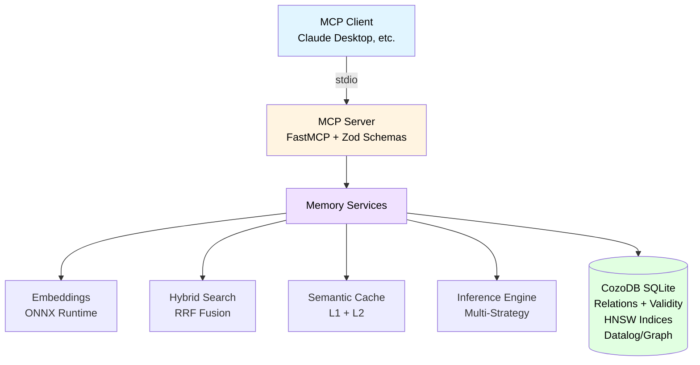
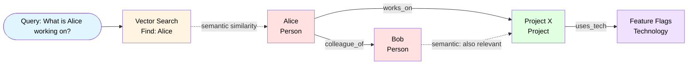

# CozoDB Memory MCP Server

[](https://www.npmjs.com/package/cozo-memory)
[](https://nodejs.org)
[](LICENSE)

**Local-first memory for Claude & AI agents with hybrid search, Graph-RAG, and time-travel – all in a single binary, no cloud, no Docker.**

## Table of Contents

- [Quick Start](#quick-start)
- [Key Features](#key-features)
- [Positioning & Comparison](#positioning--comparison)
- [Performance & Benchmarks](#performance--benchmarks)
- [Architecture](#architecture)
- [Installation](#installation)
- [Start / Integration](#start--integration)
- [Configuration & Backends](#configuration--backends)
- [Data Model](#data-model)
- [MCP Tools](#mcp-tools)
  - [mutate_memory (Write)](#mutate_memory-write)
  - [query_memory (Read)](#query_memory-read)
  - [analyze_graph (Analysis)](#analyze_graph-analysis)
  - [manage_system (Maintenance)](#manage_system-maintenance)
- [Production Monitoring](#production-monitoring)
- [Technical Highlights](#technical-highlights)
- [Optional: HTTP API Bridge](#optional-http-api-bridge)
- [Development](#development)
- [User Preference Profiling](#user-preference-profiling-mem0-style)
- [Troubleshooting](#troubleshooting)
- [Roadmap](#roadmap)
- [Contributing](#contributing)
- [License](#license)

## Quick Start

### Option 1: Install via npm (Recommended)

```bash
# Install globally
npm install -g cozo-memory

# Or run directly with npx (no installation needed)
npx cozo-memory
```

### Option 2: Build from Source

```bash
git clone https://github.com/tobs-code/cozo-memory
cd cozo-memory
npm install && npm run build
npm run start
```

Now you can add the server to your MCP client (e.g. Claude Desktop).

## Key Features

🔍 **Hybrid Search (since v0.7)** - Combines semantic search (HNSW), full-text search (FTS), and graph signals via Reciprocal Rank Fusion (RRF)

🔀 **Dynamic Fusion Framework (v2.3)** - Advanced 4-path retrieval system combining Dense Vector, Sparse Vector, FTS, and Graph traversal with configurable weights and fusion strategies (RRF, Weighted Sum, Max, Adaptive)

⏳ **Temporal Graph Neural Networks (v2.4)** - Time-aware node embeddings capturing historical context, temporal smoothness, and recency-weighted aggregation using Time2Vec encoding and multi-signal fusion

🔀 **Multi-Hop Reasoning with Vector Pivots (v2.5)** - Logic-aware Retrieve-Reason-Prune pipeline using vector search as springboard for graph traversal with helpfulness scoring and pivot depth security

🕸️ **Graph-RAG & Graph-Walking (v1.7/v2.0)** - Hierarchical retrieval with community detection and summarization; recursive traversals using optimized Datalog algorithms

🧠 **Agentic Retrieval Layer (v2.0)** - Auto-routing engine that analyzes query intent via local LLM to select the optimal search strategy (Vector, Graph, or Community)

🧠 **Multi-Level Memory (v2.0)** - Context-aware memory system with built-in session and task management

🎯 **Tiny Learned Reranker (v2.0)** - Integrated Cross-Encoder model (`ms-marco-MiniLM-L-6-v2`) for ultra-precise re-ranking of top search results

🎯 **Multi-Vector Support (since v1.7)** - Dual embeddings per entity: content-embedding for context, name-embedding for identification

⚡ **Semantic Caching (since v0.8.5)** - Two-level cache (L1 memory + L2 persistent) with semantic query matching

⏱️ **Time-Travel Queries** - Version all changes via CozoDB Validity; query any point in history

🔗 **Atomic Transactions (since v1.2)** - Multi-statement transactions ensuring data consistency

📊 **Graph Algorithms (since v1.3/v1.6)** - PageRank, Betweenness Centrality, HITS, Community Detection, Shortest Path

🏗️ **Hierarchical GraphRAG (v2.0)** - Automatic generation of thematic "Community Summaries" using local LLMs to enable global "Big Picture" reasoning

🧹 **Janitor Service** - LLM-backed automatic cleanup with hierarchical summarization, observation pruning, and **automated session compression**

🗜️ **Context Compaction & Auto-Summarization (v2.2)** - Automatic and manual memory consolidation with progressive summarization and LLM-backed Executive Summaries

🧠 **Fact Lifecycle Management (v2.1)** - Native "soft-deletion" via CozoDB Validity retraction; invalidated facts are hidden from current views but preserved in history for audit trails

👤 **User Preference Profiling** - Persistent user preferences with automatic 50% search boost

🔍 **Near-Duplicate Detection** - Automatic LSH-based deduplication to avoid redundancy

🧠 **Inference Engine** - Implicit knowledge discovery with multiple strategies

🏠 **100% Local** - Embeddings via ONNX/Transformers; no external services required

📦 **Export/Import (since v1.8)** - Export to JSON, Markdown, or Obsidian-ready ZIP; import from Mem0, MemGPT, Markdown, or native format

📄 **PDF Support (since v1.9)** - Direct PDF ingestion with text extraction via pdfjs-dist; supports file path and content parameters

🕐 **Dual Timestamp Format (since v1.9)** - All timestamps returned in both Unix microseconds and ISO 8601 format for maximum flexibility

### Detailed Features
- **Hybrid Search (v0.7 Optimized)**: Combination of semantic search (HNSW), **Full-Text Search (FTS)**, and graph signals, merged via Reciprocal Rank Fusion (RRF).
- **Full-Text Search (FTS)**: Native CozoDB v0.7 FTS indices with stemming, stopword filtering, and robust query sanitizing (cleaning of `+ - * / \ ( ) ? .`) for maximum stability.
- **Near-Duplicate Detection (LSH)**: Automatically detects very similar observations via MinHash-LSH (CozoDB v0.7) to avoid redundancy.
- **Recency Bias**: Older content is dampened in fusion (except for explicit keyword searches), so "currently relevant" appears higher more often.
- **Graph-RAG & Graph-Walking (v1.7 Optimized)**: Advanced retrieval method combining semantic vector seeds with recursive graph traversals. Now uses an optimized **Graph-Walking** algorithm via Datalog, using HNSW index lookups for precise distance calculations during traversal.
- **Multi-Vector Support (v1.7)**: Each entity now has two specialized vectors:
  1. **Content-Embedding**: Represents the content context (observations).
  2. **Name-Embedding**: Optimized for identification via name/label.
  This significantly improves accuracy when entering graph walks.
- **Semantic & Persistent Caching (v0.8.5)**: Two-level caching system:
  1. **L1 Memory Cache**: Ultra-fast in-memory LRU cache (< 0.1ms).
  2. **L2 Persistent Cache**: Storage in CozoDB for restart resistance.
  3. **Semantic Matching**: Detects semantically similar queries via vector distance.
  4. **Janitor TTL**: Automatic cleanup of outdated cache entries by the Janitor service.
- **Time-Travel**: Changes are versioned via CozoDB `Validity`; historical queries are possible.
- **JSON Merge Operator (++)**: Uses the v0.7 merge operator for efficient, atomic metadata updates.
- **Multi-Statement Transactions (v1.2)**: Supports atomic transactions across multiple operations using CozoDB block syntax `{ ... }`. Guarantees that related changes (e.g., create entity + add observation + link relationship) are executed fully or not at all.
- **Graph Metrics & Ranking Boost (v1.3 / v1.6)**: Integrates advanced graph algorithms:
  - **PageRank**: Calculates the "importance" of knowledge nodes for ranking.
  - **Betweenness Centrality**: Identifies central bridge elements in the knowledge network.
  - **HITS (Hubs & Authorities)**: Distinguishes between information sources (Authorities) and pointers (Hubs).
  - **Connected Components**: Detects isolated knowledge islands and subgraphs.
  - These metrics are automatically used in hybrid search (`advancedSearch`) and `graphRag`.
- **Native CozoDB Operators (v1.5)**: Now uses explicit `:insert`, `:update`, and `:delete` operators instead of generic `:put` (upsert) calls. Increases data safety through strict validation of database states (e.g., error when trying to "insert" an existing entity).
- **Advanced Time-Travel Analysis (v1.5)**: Extension of relationship history with time range filters (`since`/`until`) and automatic diff summaries to analyze changes (additions/removals) over specific periods.
- **Graph Features (v1.6)**: Native integration of Shortest Path (Dijkstra) with path reconstruction, Community Detection (LabelPropagation), and advanced centrality measures.
- **Graph Evolution**: Tracks the temporal development of relationships (e.g., role change from "Manager" to "Consultant") via CozoDB `Validity` queries.
- **Bridge Discovery**: Identifies "bridge entities" connecting different communities – ideal for creative brainstorming.
- **Inference**: Implicit suggestions and context extension (e.g., transitive expertise rule).
- **Conflict Detection (Application-Level & Triggers)**: Automatically detects contradictions in metadata (e.g., "active" vs. "discontinued" / `archived: true`). Uses robust logic in the app layer to ensure data integrity before writing.
- **Data Integrity (Trigger Concept)**: Prevents invalid states like self-references in relationships (Self-Loops) directly at creation.
- **Hierarchical Summarization**: The Janitor condenses old fragments into "Executive Summary" nodes to preserve the "Big Picture" long-term.
- **User Preference Profiling**: A specialized `global_user_profile` entity stores persistent preferences (likes, work style), which receive a **50% score boost** in every search.
- **Fact Lifecycle Management (v2.1)**: Uses CozoDB's native **Validity** retraction mechanism to manage the lifecycle of information. Instead of destructive deletions, facts are invalidated by asserting a `[timestamp, false]` record. This ensures:
  1. **Auditability**: You can always "time-travel" back to see what the system knew at any given point.
  2. **Consistency**: All standard retrieval (Search, Graph-RAG, Inference) uses the `@ "NOW"` filter to automatically exclude retracted facts.
  3. **Atomic Retraction**: Invalidation can be part of a multi-statement transaction, allowing for clean "update" patterns (invalidate old + insert new).
- **All Local**: Embeddings via Transformers/ONNX; no external embedding service required.

## Positioning & Comparison

Most "Memory" MCP servers fall into two categories:
1.  **Simple Knowledge Graphs**: CRUD operations on triples, often only text search.
2.  **Pure Vector Stores**: Semantic search (RAG), but little understanding of complex relationships.

This server fills the gap in between ("Sweet Spot"): A **local, database-backed memory engine** combining vector, graph, and keyword signals.

### Comparison with other solutions

| Feature | **CozoDB Memory (This Project)** | **Official Reference (`@modelcontextprotocol/server-memory`)** | **mcp-memory-service (Community)** | **Database Adapters (Qdrant/Neo4j)** |
| :--- | :--- | :--- | :--- | :--- |
| **Backend** | **CozoDB** (Graph + Vector + Relational) | JSON file (`memory.jsonl`) | SQLite / Cloudflare | Specialized DB (only Vector or Graph) |
| **Search Logic** | **Agentic (Auto-Route)**: Hybrid + Graph + Summaries | Keyword only / Exact Graph Match | Vector + Keyword | Mostly only one dimension |
| **Inference** | **Yes**: Built-in engine for implicit knowledge | No | No ("Dreaming" is consolidation) | No (Retrieval only) |
| **Community** | **Yes**: Hierarchical Community Summaries | No | No | Only clustering (no summary) |
| **Time-Travel** | **Yes**: Queries at any point in time (`Validity`) | No (current state only) | History available, no native DB feature | No |
| **Maintenance** | **Janitor**: LLM-backed cleanup | Manual | Automatic consolidation | Mostly manual |
| **Deployment** | **Local** (Node.js + Embedded DB) | Local (Docker/NPX) | Local or Cloud | Often requires external DB server |

The core advantage is **Intelligence and Traceability**: By combining an **Agentic Retrieval Layer** with **Hierarchical GraphRAG**, the system can answer both specific factual questions and broad thematic queries with much higher accuracy than pure vector stores.

## Performance & Benchmarks

Benchmarks on a standard developer laptop (Windows, Node.js 20+, CPU-only):

| Metric | Value | Note |
| :--- | :--- | :--- |
| **Graph-Walking (Recursive)** | **~130 ms** | Vector Seed + Recursive Datalog Traversal |
| **Graph-RAG (Breadth-First)** | **~335 ms** | Vector Seeds + 2-Hop Expansion |
| **Hybrid Search (Cache Hit)** | **< 0.1 ms** | **v0.8+ Semantic Cache** |
| **Hybrid Search (Cold)** | **~35 ms** | FTS + HNSW + RRF Fusion |
| **Vector Search (Raw)** | **~51 ms** | Pure semantic search as reference |
| **FTS Search (Raw)** | **~12 ms** | Native Full-Text Search Performance |
| **Ingestion** | **~102 ms** | Per Op (Write + Embedding + FTS/LSH Indexing) |
| **RAM Usage** | **~1.7 GB** | Primarily due to local `Xenova/bge-m3` model |

### Running Benchmarks

You can test performance on your system with the integrated benchmark tool:

```bash
npm run benchmark
```

This tool (`src/benchmark.ts`) performs the following tests:
1.  **Initialization**: Cold start duration of the server incl. model loading.
2.  **Ingestion**: Mass import of test entities and observations (throughput).
3.  **Search Performance**: Latency measurement for Hybrid Search vs. Raw Vector Search.
4.  **RRF Overhead**: Determination of additional computation time for fusion logic.

### Running Evaluation Suite (RAG Quality)

To evaluate the quality and recall of different retrieval strategies (Search vs. Graph-RAG vs. Graph-Walking), use the evaluation suite:

```bash
npm run eval
 ```
 
This tool compares strategies using a synthetic dataset and measures **Recall@K**, **MRR**, and **Latency**.

| Method | Recall@10 | Avg Latency | Best For |
| :--- | :--- | :--- | :--- |
| **Graph-RAG** | **1.00** | **~32 ms** | Deep relational reasoning |
| **Graph-RAG (Reranked)** | **1.00** | **~36 ms** | Maximum precision for relational data |
| **Graph-Walking** | 1.00 | ~50 ms | Associative path exploration |
| **Hybrid Search** | 1.00 | ~89 ms | Broad factual retrieval |
| **Reranked Search** | 1.00 | ~20 ms* | Ultra-precise factual search (Warm cache) |

## Architecture



### Graph-Walking Visualization



## Installation

### Prerequisites
- Node.js 20+ (recommended)
- **RAM: 1.7 GB minimum** (for default bge-m3 model)
  - Model download: ~600 MB
  - Runtime memory: ~1.1 GB
  - For lower-spec machines, see [Embedding Model Options](#embedding-model-options) below
- CozoDB native dependency is installed via `cozo-node`

### Via npm (Easiest)

```bash
# Install globally
npm install -g cozo-memory

# Or use npx without installation
npx cozo-memory
```

### From Source

```bash
git clone https://github.com/tobs-code/cozo-memory
cd cozo-memory
npm install
npm run build
```

### Windows Quickstart

```bash
npm install
npm run build
npm run start
```

Notes:
- On first start, `@xenova/transformers` downloads the embedding model (may take time).
- Embeddings are processed on the CPU.

### Embedding Model Options

CozoDB Memory supports multiple embedding models via the `EMBEDDING_MODEL` environment variable:

| Model | Size | RAM | Dimensions | Best For |
|-------|------|-----|------------|----------|
| `Xenova/bge-m3` (default) | ~600 MB | ~1.7 GB | 1024 | High accuracy, production use |
| `Xenova/all-MiniLM-L6-v2` | ~80 MB | ~400 MB | 384 | Low-spec machines, development |
| `Xenova/bge-small-en-v1.5` | ~130 MB | ~600 MB | 384 | Balanced performance |

**Configuration Options:**

**Option 1: Using `.env` file (Easiest for beginners)**

```bash
# Copy the example file
cp .env.example .env

# Edit .env and set your preferred model
EMBEDDING_MODEL=Xenova/all-MiniLM-L6-v2
```

**Option 2: MCP Server Config (For Claude Desktop / Kiro)**

```json
{
  "mcpServers": {
    "cozo-memory": {
      "command": "npx",
      "args": ["cozo-memory"],
      "env": {
        "EMBEDDING_MODEL": "Xenova/all-MiniLM-L6-v2"
      }
    }
  }
}
```

**Option 3: Command Line**

```bash
# Use lightweight model for development
EMBEDDING_MODEL=Xenova/all-MiniLM-L6-v2 npm run start
```

**Download Model First (Recommended):**

```bash
# Set model in .env or via command line, then:
EMBEDDING_MODEL=Xenova/all-MiniLM-L6-v2 npm run download-model
```
}
```

**Note:** Changing models requires re-embedding existing data. The model is downloaded once on first use.

## Framework Adapters

Official adapters for seamless integration with popular AI frameworks:

### 🦜 LangChain Adapter

```bash
npm install @cozo-memory/langchain @cozo-memory/adapters-core
```

```typescript
import { CozoMemoryChatHistory, CozoMemoryRetriever } from '@cozo-memory/langchain';
import { BufferMemory } from 'langchain/memory';

// Chat history with session management
const chatHistory = new CozoMemoryChatHistory({
  sessionName: 'user-123'
});

const memory = new BufferMemory({ chatHistory });

// Retriever with hybrid search or Graph-RAG
const retriever = new CozoMemoryRetriever({
  useGraphRAG: true,
  graphRAGDepth: 2
});
```

### 🦙 LlamaIndex Adapter

```bash
npm install @cozo-memory/llamaindex @cozo-memory/adapters-core
```

```typescript
import { CozoVectorStore } from '@cozo-memory/llamaindex';
import { VectorStoreIndex } from 'llamaindex';

// Vector store with Graph-RAG support
const vectorStore = new CozoVectorStore({
  useGraphRAG: true
});

const index = await VectorStoreIndex.fromDocuments(
  documents,
  { vectorStore }
);
```

**Features:**
- ✅ Persistent chat history (LangChain)
- ✅ Hybrid search retrieval (both)
- ✅ Graph-RAG mode (both)
- ✅ Session management (LangChain)
- ✅ Vector store operations (LlamaIndex)

**Documentation:** See [adapters/README.md](./adapters/README.md) for complete examples and API reference.

## Temporal Graph Neural Networks (v2.4)

CozoDB Memory now includes **Temporal Graph Neural Network (TGNN) embeddings** that capture time-aware node representations combining historical context, temporal smoothness, and graph structure.

### What are Temporal Embeddings?

Traditional embeddings are static snapshots. Temporal embeddings evolve over time, capturing:

1. **Historical Context** - Weighted aggregation of past observations with exponential decay
2. **Temporal Smoothness** - Recency-weighted signals ensure gradual changes, not sudden jumps
3. **Time Encoding** - Time2Vec-inspired sinusoidal encoding captures periodicity and time differences
4. **Neighborhood Aggregation** - Related entities influence the embedding through weighted graph signals

### Architecture

```
Entity Embedding = Fuse(
  content_embedding (0.4),      # Semantic meaning
  temporal_encoding (0.2),      # Time information (Time2Vec)
  historical_context (0.2),     # Past observations (exponential decay)
  neighborhood_agg (0.2)        # Related entities (graph signals)
)
```

### Key Features

- **Time2Vec Encoding** - Sinusoidal functions capture temporal patterns without discretization
- **Exponential Decay Weighting** - Recent observations matter more (30-day half-life)
- **Multi-Signal Fusion** - Combines content, temporal, historical, and graph signals
- **Confidence Scoring** - Reflects data freshness and completeness (0-1 scale)
- **Memory Caching** - Efficient temporal state for multi-hop traversals
- **Time-Travel Support** - Generate embeddings at any historical timepoint via CozoDB Validity

### Usage Example

```typescript
import { TemporalEmbeddingService } from 'cozo-memory';

const temporalService = new TemporalEmbeddingService(
  embeddingService,
  dbQuery
);

// Generate embedding at current time
const embedding = await temporalService.generateTemporalEmbedding(
  entityId,
  new Date()
);

// Or at a historical timepoint
const pastEmbedding = await temporalService.generateTemporalEmbedding(
  entityId,
  new Date('2026-02-01')
);

// Compare temporal trajectories
const similarity = cosineSimilarity(
  embedding.embedding,
  pastEmbedding.embedding
);
```

### Confidence Scoring

Confidence reflects data quality and freshness:

```
Base: 0.5
+ Recent entity (< 7 days): +0.3
+ Many observations (> 5): +0.15
+ Well-connected (> 10 relations): +0.15
= Max: 1.0
```

### Research Foundation

Based on cutting-edge research (2023-2026):

- **ACM Temporal Graph Learning Primer** (2025) - Comprehensive TGNN taxonomy
- **TempGNN** (2023) - Temporal embeddings for dynamic session-based recommendations
- **Time-Aware Graph Embedding** (2021) - Temporal smoothness and task-oriented approaches
- **Allan-Poe** (2025) - All-in-One Graph-Based Hybrid Search with dynamic fusion

### Testing

```bash
npx ts-node src/test-temporal-embeddings.ts
```

## Start / Integration

### MCP Server (stdio)

The MCP server runs over stdio (for Claude Desktop etc.). Start:

```bash
npm run start
```

Default database path: `memory_db.cozo.db` in project root (created automatically).

### CLI Tool

CozoDB Memory includes a full-featured CLI for all operations:

```bash
# System operations
cozo-memory system health
cozo-memory system metrics
cozo-memory system reflect

# Entity operations
cozo-memory entity create -n "MyEntity" -t "person" -m '{"age": 30}'
cozo-memory entity get -i <entity-id>
cozo-memory entity delete -i <entity-id>

# Observations
cozo-memory observation add -i <entity-id> -t "Some note"

# Relations
cozo-memory relation create --from <id1> --to <id2> --type "knows" -s 0.8

# Search
cozo-memory search query -q "search term" -l 10
cozo-memory search context -q "context query"
cozo-memory search agentic -q "agentic query"

# Graph operations
cozo-memory graph explore -s <entity-id> -h 3
cozo-memory graph pagerank
cozo-memory graph communities
cozo-memory graph summarize

# Session & Task management
cozo-memory session start -n "My Session"
cozo-memory session stop -i <session-id>
cozo-memory task start -n "My Task" -s <session-id>
cozo-memory task stop -i <task-id>

# Export/Import
cozo-memory export json -o backup.json --include-metadata --include-relationships --include-observations
cozo-memory export markdown -o notes.md
cozo-memory export obsidian -o vault.zip
cozo-memory import file -i data.json -f cozo

# All commands support -f json or -f pretty for output formatting
```

### TUI (Terminal User Interface)

Interactive TUI with mouse support powered by Python Textual:

```bash
# Install Python dependencies (one-time)
pip install textual

# Launch TUI
npm run tui
# or directly:
cozo-memory-tui
```

**TUI Features:**
- 🖱️ Full mouse support (click buttons, scroll, select inputs)
- ⌨️ Keyboard shortcuts (q=quit, h=help, r=refresh)
- 📊 Interactive menus for all operations
- 🎨 Rich terminal UI with colors and animations
- 📋 Real-time results display
- 🔍 Forms for entity creation, search, graph operations
- 📤 Export/Import wizards

### Claude Desktop Integration

#### Using npx (Recommended)

```json
{
  "mcpServers": {
    "cozo-memory": {
      "command": "npx",
      "args": ["cozo-memory"]
    }
  }
}
```

#### Using global installation

```json
{
  "mcpServers": {
    "cozo-memory": {
      "command": "cozo-memory"
    }
  }
}
```

#### Using local build

```json
{
  "mcpServers": {
    "cozo-memory": {
      "command": "node",
      "args": ["C:/Path/to/cozo-memory/dist/index.js"]
    }
  }
}
```

## Configuration & Backends

The system supports various storage backends. **SQLite** is used by default as it requires no extra installation and offers the best balance of performance and simplicity for most use cases.

### Changing Backend (e.g., to RocksDB)

RocksDB offers advantages for very large datasets (millions of entries) and write-intensive workloads due to better parallelism and data compression.

To change the backend, set the `DB_ENGINE` environment variable before starting:

**PowerShell:**
```powershell
$env:DB_ENGINE="rocksdb"; npm run dev
```

**Bash:**
```bash
DB_ENGINE=rocksdb npm run dev
```

| Backend | Status | Recommendation |
| :--- | :--- | :--- |
| **SQLite** | Active (Default) | Standard for desktop/local usage. |
| **RocksDB** | Prepared & Tested | For high-performance or very large datasets. |
| **MDBX** | Not supported | Requires manual build of `cozo-node` from source. |

### Environment Variables

| Variable | Default | Description |
|----------|---------|-------------|
| `DB_ENGINE` | `sqlite` | Database backend: `sqlite` or `rocksdb` |
| `EMBEDDING_MODEL` | `Xenova/bge-m3` | Embedding model (see [Embedding Model Options](#embedding-model-options)) |
| `PORT` | `3001` | HTTP API bridge port (if using `npm run bridge`) |

---

## Data Model

CozoDB Relations (simplified) – all write operations create new `Validity` entries (Time-Travel):
- `entity`: `id`, `created_at: Validity` ⇒ `name`, `type`, `embedding(1024)`, `name_embedding(1024)`, `metadata(Json)`
- `observation`: `id`, `created_at: Validity` ⇒ `entity_id`, `text`, `embedding(1024)`, `metadata(Json)`
- `relationship`: `from_id`, `to_id`, `relation_type`, `created_at: Validity` ⇒ `strength(0..1)`, `metadata(Json)`
- `entity_community`: `entity_id` ⇒ `community_id` (Key-Value Mapping from LabelPropagation)
- `memory_snapshot`: `snapshot_id` ⇒ Counts + `metadata` + `created_at(Int)`

## MCP Tools

The interface is reduced to **4 consolidated tools**. The concrete operation is always chosen via `action`.

| Tool | Purpose | Key Actions |
|------|---------|-------------|
| `mutate_memory` | Write operations | create_entity, update_entity, delete_entity, add_observation, create_relation, start_session, stop_session, start_task, stop_task, run_transaction, add_inference_rule, ingest_file, invalidate_observation, invalidate_relation |
| `query_memory` | Read operations | search, advancedSearch, context, entity_details, history, graph_rag, graph_walking, agentic_search, dynamic_fusion (Multi-Level Context support) |
| `analyze_graph` | Graph analysis | explore, communities, pagerank, betweenness, hits, shortest_path, bridge_discovery, semantic_walk, infer_relations |
| `manage_system` | Maintenance | health, metrics, export_memory, import_memory, snapshot_create, snapshot_list, snapshot_diff, cleanup, defrag, reflect, summarize_communities, clear_memory, compact |

### mutate_memory (Write)

Actions:
- `create_entity`: `{ name, type, metadata? }`
- `update_entity`: `{ id, name?, type?, metadata? }`
- `delete_entity`: `{ entity_id }`
- `add_observation`: `{ entity_id?, entity_name?, entity_type?, text, metadata? }`
- `create_relation`: `{ from_id, to_id, relation_type, strength?, metadata? }`
- `start_session`: `{ name?, metadata? }` **(New v2.0)**: Starts a new session context (metadata can include `user_id`, `project`, etc.)
- `stop_session`: `{ session_id }` **(New v2.0)**: Closes/archives an active session.
- `start_task`: `{ name, session_id?, metadata? }` **(New v2.0)**: Starts a specific task within a session.
- `stop_task`: `{ task_id }` **(New v2.0)**: Marks a task as completed.
- `run_transaction`: `{ operations: Array<{ action, params }> }` **(New v1.2)**: Executes multiple operations atomically.
- `add_inference_rule`: `{ name, datalog }`
- `ingest_file`: `{ format, file_path?, content?, entity_id?, entity_name?, entity_type?, chunking?, metadata?, observation_metadata?, deduplicate?, max_observations? }`
- `invalidate_observation`: `{ observation_id }` **(New v2.1)**: Retracts an observation using Validity `[now, false]`.
- `invalidate_relation`: `{ from_id, to_id, relation_type }` **(New v2.1)**: Retracts a relationship using Validity `[now, false]`.
  - `format` options: `"markdown"`, `"json"`, `"pdf"` **(New v1.9)**
  - `file_path`: Optional path to file on disk (alternative to `content` parameter)
  - `content`: File content as string (required if `file_path` not provided)
  - `chunking` options: `"none"`, `"paragraphs"` (future: `"semantic"`)

Important Details:
- `run_transaction` supports `create_entity`, `add_observation`, and `create_relation`. Parameters are automatically suffixed to avoid collisions.
- `create_relation` rejects self-references (`from_id === to_id`).
- `strength` is optional and defaults to `1.0`.
- `add_observation` additionally provides `inferred_suggestions` (suggestions from the Inference Engine).
- `add_observation` performs deduplication (exact + semantic via LSH). If duplicates are found, returns `status: "duplicate_detected"` with `existing_observation_id` and an estimated `similarity`.
- `update_entity` uses the JSON Merge Operator `++` (v0.7) to merge existing metadata with new values instead of overwriting them.
- `add_inference_rule` validates Datalog code upon saving. Invalid syntax or missing required columns result in an error.

Examples:

```json
{ "action": "create_entity", "name": "Alice", "type": "Person", "metadata": { "role": "Dev" } }
```

```json
{ "action": "add_observation", "entity_id": "ENTITY_ID", "text": "Alice is working on the feature flag system." }
```

Example (Duplicate):

```json
{ "action": "add_observation", "entity_id": "ENTITY_ID", "text": "Alice is working on the feature flag system." }
```

```json
{ "status": "duplicate_detected", "existing_observation_id": "OBS_ID", "similarity": 1 }
```

```json
{ "action": "create_relation", "from_id": "ALICE_ID", "to_id": "PROJ_ID", "relation_type": "works_on", "strength": 1.0 }
```

Custom Datalog Rules (Inference):

- Inference rules are stored as `action: "add_inference_rule"`.
- The Datalog query must return a result set with **exactly these 5 columns**: `from_id, to_id, relation_type, confidence, reason`.
- `$id` is the placeholder for the entity ID for which inference is started.

Example (Transitive Manager ⇒ Upper Manager):

```json
{
  "action": "add_inference_rule",
  "name": "upper_manager",
  "datalog": "?[from_id, to_id, relation_type, confidence, reason] :=\n  *relationship{from_id: $id, to_id: mid, relation_type: \"manager_of\", @ \"NOW\"},\n  *relationship{from_id: mid, to_id: target, relation_type: \"manager_of\", @ \"NOW\"},\n  from_id = $id,\n  to_id = target,\n  relation_type = \"upper_manager_of\",\n  confidence = 0.6,\n  reason = \"Transitive manager path found\""
}
```

Bulk Ingestion (Markdown/JSON/PDF):

```json
{
  "action": "ingest_file",
  "entity_name": "Project Documentation",
  "format": "markdown",
  "chunking": "paragraphs",
  "content": "# Title\n\nSection 1...\n\nSection 2...",
  "deduplicate": true,
  "max_observations": 50
}
```

PDF Ingestion via File Path:

```json
{
  "action": "ingest_file",
  "entity_name": "Research Paper",
  "format": "pdf",
  "file_path": "/path/to/document.pdf",
  "chunking": "paragraphs",
  "deduplicate": true
}
```

### query_memory (Read)

Actions:
- `search`: `{ query, limit?, entity_types?, include_entities?, include_observations?, rerank? }`
- `advancedSearch`: `{ query, limit?, filters?, graphConstraints?, vectorOptions?, rerank? }`
- `context`: `{ query, context_window?, time_range_hours? }`
- `entity_details`: `{ entity_id, as_of? }`
- `history`: `{ entity_id }`
- `graph_rag`: `{ query, max_depth?, limit?, filters?, rerank? }` Graph-based reasoning. Finds vector seeds (with inline filtering) first and then expands transitive relationships. Uses recursive Datalog for efficient BFS expansion.
- `graph_walking`: `{ query, start_entity_id?, max_depth?, limit? }` (v1.7) Recursive semantic graph search. Starts at vector seeds or a specific entity and follows relationships to other semantically relevant entities. Ideal for deeper path exploration.
- `agentic_search`: `{ query, limit?, rerank? }` **(New v2.0)**: **Auto-Routing Search**. Uses a local LLM (Ollama) to analyze query intent and automatically routes it to the most appropriate strategy (`vector_search`, `graph_walk`, or `community_summary`).
- `dynamic_fusion`: `{ query, config?, limit? }` **(New v2.3)**: **Dynamic Fusion Framework**. Combines 4 retrieval paths (Dense Vector, Sparse Vector, FTS, Graph) with configurable weights and fusion strategies. Inspired by Allan-Poe (arXiv:2511.00855).
- `get_relation_evolution`: `{ from_id, to_id?, since?, until? }` (in `analyze_graph`) Shows temporal development of relationships including time range filter and diff summary.

Important Details:
- `advancedSearch` allows precise filtering:
    - `filters.entityTypes`: List of entity types.
    - `filters.metadata`: Key-Value Map for exact metadata matches.
    - `graphConstraints.requiredRelations`: Only entities having certain relationships.
    - `graphConstraints.targetEntityIds`: Only entities connected to these target IDs.
- `context` returns a JSON object with entities, observations, graph connections, and inference suggestions.
- `search` uses RRF (Reciprocal Rank Fusion) to mix vector and keyword signals.
- `graph_rag` combines vector search with graph-based traversals (default depth 2) for "structured reasoning". Expansion is bidirectional across all relationship types.
- **User Profiling**: Results linked to the `global_user_profile` entity are automatically preferred (boosted).
- `time_range_hours` filters candidate results in the time window (in hours, can be float).
- `as_of` accepts ISO strings or `"NOW"`; invalid format results in an error.
- If status contradictions are detected, optional `conflict_flag` is attached to entities/observations; `context` additionally provides `conflict_flags` as a summary.

Examples:

```json
{ "action": "search", "query": "Feature Flag", "limit": 10 }
```

```json
{ 
  "action": "advancedSearch", 
  "query": "Manager", 
  "filters": { "metadata": { "role": "Lead" } },
  "graphConstraints": { "requiredRelations": ["works_with"] }
}
```

```json
{ "action": "graph_rag", "query": "What is Alice working on?", "max_depth": 2 }
```

```json
{ "action": "context", "query": "What is Alice working on right now?", "context_window": 20 }
```

#### Dynamic Fusion Framework (v2.3)

The Dynamic Fusion Framework combines 4 retrieval paths with configurable weights and fusion strategies:

**Retrieval Paths:**
1. **Dense Vector Search (HNSW)**: Semantic similarity via embeddings
2. **Sparse Vector Search**: Keyword-based matching with TF-IDF scoring
3. **Full-Text Search (FTS)**: BM25 scoring on entity names
4. **Graph Traversal**: Multi-hop relationship expansion from vector seeds

**Fusion Strategies:**
- `rrf` (Reciprocal Rank Fusion): Combines rankings with position-based scoring
- `weighted_sum`: Direct weighted combination of scores
- `max`: Takes maximum score across all paths
- `adaptive`: Query-dependent weighting (future enhancement)

**Configuration Example:**

```json
{
  "action": "dynamic_fusion",
  "query": "database with graph capabilities",
  "limit": 10,
  "config": {
    "vector": {
      "enabled": true,
      "weight": 0.4,
      "topK": 20,
      "efSearch": 100
    },
    "sparse": {
      "enabled": true,
      "weight": 0.3,
      "topK": 20,
      "minScore": 0.1
    },
    "fts": {
      "enabled": true,
      "weight": 0.2,
      "topK": 20,
      "fuzzy": true
    },
    "graph": {
      "enabled": true,
      "weight": 0.1,
      "maxDepth": 2,
      "maxResults": 20,
      "relationTypes": ["related_to", "uses"]
    },
    "fusion": {
      "strategy": "rrf",
      "rrfK": 60,
      "minScore": 0.0,
      "deduplication": true
    }
  }
}
```

**Response includes:**
- `results`: Fused and ranked results with path contribution details
- `stats`: Performance metrics including:
  - `totalResults`: Number of results after fusion
  - `pathContributions`: Count of results from each path
  - `fusionTime`: Total execution time
  - `pathTimes`: Individual execution times per path

**Use Cases:**
- **Broad Exploration**: Enable all paths with balanced weights
- **Precision Search**: High vector weight, low graph weight
- **Relationship Discovery**: High graph weight with specific relation types
- **Keyword Matching**: High sparse/FTS weights for exact term matching

```json

#### Conflict Detection (Status)

If there are contradictory statements about the status of an entity, a conflict is marked. The system considers **temporal consistency**:

- **Status Contradiction**: An entity has both "active" and "inactive" status in the **same calendar year**.
- **Status Change (No Conflict)**: If statements are from different years (e.g., 2024 "discontinued", 2025 "active"), this is interpreted as a legitimate change and **not** marked as a conflict.

The detection uses regex matching on keywords like:
- **Active**: active, running, ongoing, in operation, continued, not discontinued.
- **Inactive**: discontinued, cancelled, stopped, shut down, closed, deprecated, archived, ended, abandoned.

**Integration in API Responses:**
- `entities[i].conflict_flag` or `observations[i].conflict_flag`: Flag directly on the match.
- `conflict_flags`: List of all detected conflicts in `context` or `search` result.

### analyze_graph (Analysis)

Actions:
- `explore`: `{ start_entity, end_entity?, max_hops?, relation_types? }`
    - with `end_entity`: shortest path (BFS)
    - without `end_entity`: Neighborhood up to max. 5 hops (aggregated by minimal hop count)
- `communities`: `{}` recalculates communities and writes `entity_community`
- `pagerank`: `{}` Calculates PageRank scores for all entities.
- `betweenness`: `{}` Calculates Betweenness Centrality (centrality measure for bridge elements).
- `hits`: `{}` Calculates HITS scores (Hubs & Authorities).
- `connected_components`: `{}` Identifies isolated subgraphs.
- `shortest_path`: `{ start_entity, end_entity }` Calculates shortest path via Dijkstra (incl. distance and path reconstruction).
- `bridge_discovery`: `{}` Searches for entities acting as bridges between isolated communities (high Betweenness relevance).
- `semantic_walk`: `{ start_entity, max_depth?, min_similarity? }` (v1.7) Recursive semantic graph search. Starts at an entity and recursively follows paths consisting of explicit relationships AND semantic similarity (vector distance). Finds "associative paths" in the knowledge graph.
- `hnsw_clusters`: `{}` Analyzes clusters directly on the HNSW graph (Layer 0). Extremely fast as no vector calculations are needed.
- `infer_relations`: `{ entity_id }` provides suggestions from multiple strategies.
- `get_relation_evolution`: `{ from_id, to_id?, since?, until? }` shows temporal development of relationships including time range filter and diff summary.

Examples:

```json
{ "action": "shortest_path", "start_entity": "ID_A", "end_entity": "ID_B" }
```

```json
{ "action": "explore", "start_entity": "ENTITY_ID", "max_hops": 3 }
```

### manage_system (Maintenance)

Actions:
- `health`: `{}` returns DB counts + embedding cache stats + performance metrics.
- `metrics`: `{}` returns detailed operation counts, error statistics, and performance data.
- `export_memory`: `{ format, includeMetadata?, includeRelationships?, includeObservations?, entityTypes?, since? }` exports memory to various formats.
- `import_memory`: `{ data, sourceFormat, mergeStrategy?, defaultEntityType? }` imports memory from external sources.
- `snapshot_create`: `{ metadata? }`
- `snapshot_list`: `{}`
- `snapshot_diff`: `{ snapshot_id_a, snapshot_id_b }`
- `cleanup`: `{ confirm, older_than_days?, max_observations?, min_entity_degree?, model? }`
- `defrag`: `{ confirm, similarity_threshold?, min_island_size? }` **(New v2.3)**: Memory defragmentation. Reorganizes memory structure by:
  - **Duplicate Detection**: Finds and merges near-duplicate observations using cosine similarity (threshold 0.8-1.0, default 0.95)
  - **Island Connection**: Connects small knowledge islands (≤3 nodes) to main graph via semantic bridges
  - **Orphan Removal**: Deletes orphaned entities without observations or relations
  - With `confirm: false`: Dry-run mode showing candidates without making changes
  - With `confirm: true`: Executes defragmentation and returns statistics
- `compact`: `{ session_id?, entity_id?, model? }` **(New v2.2)**: Manual context compaction. Supports three modes:
  - **Session Compaction**: `{ session_id, model? }` - Summarizes session observations into 2-3 bullet points and stores in user profile
  - **Entity Compaction**: `{ entity_id, model? }` - Compacts entity observations when threshold exceeded, creates Executive Summary
  - **Global Compaction**: `{}` (no parameters) - Compacts all entities exceeding threshold (default: 20 observations)
- `summarize_communities`: `{ model?, min_community_size? }` **(New v2.0)**: Triggers the **Hierarchical GraphRAG** pipeline. Recomputes communities, generates thematic summaries via LLM, and stores them as `CommunitySummary` entities.
- `reflect`: `{ entity_id?, mode?, model? }` Analyzes memory for contradictions and new insights. Supports `summary` (default) and `discovery` (autonomous link refinement) modes.
- `clear_memory`: `{ confirm }`

Janitor Cleanup Details:
- `cleanup` supports `dry_run`: with `confirm: false` only candidates are listed.
- With `confirm: true`, the Janitor becomes active:
  - **Hierarchical Summarization**: Detects isolated or old observations, has them summarized by a local LLM (Ollama), and creates a new `ExecutiveSummary` node. Old fragments are deleted to reduce noise while preserving knowledge.
  - **Automated Session Compression**: Automatically identifies inactive sessions, summarizes their activity into a few bullet points, and stores the summary in the User Profile while marking the session as archived.

Context Compaction Details **(New v2.2)**:
- **Automatic Compaction**: Triggered automatically when observations exceed threshold (default: 20)
  - Runs in background during `addObservation`
  - Uses lock mechanism to prevent concurrent compaction
- **Manual Compaction**: Available via `compact` action in `manage_system`
  - **Session Mode**: Summarizes session observations and stores in `global_user_profile`
  - **Entity Mode**: Compacts specific entity with custom threshold
  - **Global Mode**: Compacts all entities exceeding threshold
- **Progressive Summarization**: New observations are merged with existing Executive Summaries instead of simple append
- **LLM Integration**: Uses Ollama (default model: `demyagent-4b-i1:Q6_K`) for intelligent summarization

**Before Janitor:**
```
Entity: Project X
├─ Observation 1: "Started in Q1" (90 days old, isolated)
├─ Observation 2: "Uses React" (85 days old, isolated)
├─ Observation 3: "Team of 5" (80 days old, isolated)
└─ Observation 4: "Deployed to staging" (75 days old, isolated)
```

**After Janitor:**
```
Entity: Project X
└─ ExecutiveSummary: "Project X is a React-based application started in Q1 
   with a team of 5 developers, currently deployed to staging environment."
```

### Self-Improving Memory Loop (`reflect`)
The `reflect` service analyzes observations of an entity (or top 5 active entities) to find contradictions, patterns, or temporal developments.
- **Modes**:
  - `summary` (default): Generates a textual "Reflective Insight" observation.
  - `discovery`: Autonomously finds potential relationships using the Inference Engine and validates them via LLM. 
    - High-confidence links (>0.8) are created automatically.
    - Medium-confidence links (>0.5) are returned as suggestions.
- Results are persisted as new observations (for `summary`) or relationships (for `discovery`) with metadata field `{ "kind": "reflection" }` or `{ "source": "reflection" }`.
- Text is stored with prefix `Reflective Insight: `.

Defaults: `older_than_days=30`, `max_observations=20`, `min_entity_degree=2`, `model="demyagent-4b-i1:Q6_K"`.

Export/Import Details:
- `export_memory` supports three formats:
  - **JSON** (`format: "json"`): Native Cozo format, fully re-importable with all metadata and timestamps.
  - **Markdown** (`format: "markdown"`): Human-readable document with entities, observations, and relationships.
  - **Obsidian** (`format: "obsidian"`): ZIP archive with Wiki-Links `[[Entity]]`, YAML frontmatter, ready for Obsidian vault.
- `import_memory` supports four source formats:
  - **Cozo** (`sourceFormat: "cozo"`): Import from native JSON export.
  - **Mem0** (`sourceFormat: "mem0"`): Import from Mem0 format (user_id becomes entity).
  - **MemGPT** (`sourceFormat: "memgpt"`): Import from MemGPT archival/recall memory.
  - **Markdown** (`sourceFormat: "markdown"`): Parse markdown sections as entities with observations.
- Merge strategies: `skip` (default, skip duplicates), `overwrite` (replace existing), `merge` (combine metadata).
- Optional filters: `entityTypes` (array), `since` (Unix timestamp in ms), `includeMetadata`, `includeRelationships`, `includeObservations`.

Example Export:
```json
{
  "action": "export_memory",
  "format": "obsidian",
  "includeMetadata": true,
  "entityTypes": ["Person", "Project"]
}
```

Example Import:
```json
{
  "action": "import_memory",
  "sourceFormat": "mem0",
  "data": "{\"user_id\": \"alice\", \"memories\": [...]}",
  "mergeStrategy": "skip"
}
```

Production Monitoring Details:
- `health` provides comprehensive system status including entity/observation/relationship counts, embedding cache statistics, and performance metrics (last operation time, average operation time, total operations).
- `metrics` returns detailed operational metrics:
  - **Operation Counts**: Tracks create_entity, update_entity, delete_entity, add_observation, create_relation, search, and graph_operations.
  - **Error Statistics**: Total errors and breakdown by operation type.
  - **Performance Metrics**: Last operation duration, average operation duration, and total operations executed.
- Delete operations now include detailed logging with verification steps and return statistics about deleted data (observations, outgoing/incoming relations).

## Production Monitoring

The system includes comprehensive monitoring capabilities for production deployments:

### Metrics Tracking

All operations are automatically tracked with detailed metrics:
- Operation counts by type (create, update, delete, search, etc.)
- Error tracking with breakdown by operation
- Performance metrics (latency, throughput)

### Health Endpoint

The `health` action provides real-time system status:
```json
{ "action": "health" }
```

Returns:
- Database counts (entities, observations, relationships)
- Embedding cache statistics (hit rate, size)
- Performance metrics (last operation time, average time, total operations)

### Metrics Endpoint

The `metrics` action provides detailed operational metrics:
```json
{ "action": "metrics" }
```

Returns:
- **operations**: Count of each operation type
- **errors**: Total errors and breakdown by operation
- **performance**: Last operation duration, average duration, total operations

### Enhanced Delete Operations

Delete operations include comprehensive logging and verification:
- Detailed step-by-step logging with `[Delete]` prefix
- Counts related data before deletion
- Verification after deletion
- Returns statistics: `{ deleted: { observations: N, outgoing_relations: N, incoming_relations: N } }`

Example:
```json
{ "action": "delete_entity", "entity_id": "ENTITY_ID" }
```

Returns deletion statistics showing exactly what was removed.

## Multi-Hop Reasoning with Vector Pivots (v2.5)

**Research-backed implementation** based on HopRAG (ACL 2025), Retrieval Pivot Attacks (arXiv:2602.08668), and Neo4j GraphRAG patterns.

### Retrieve-Reason-Prune Pipeline

1. **RETRIEVE**: Find semantic pivot points via HNSW vector search
2. **REASON**: Logic-aware graph traversal with relationship context
3. **PRUNE**: Helpfulness scoring combining textual similarity + logical importance
4. **AGGREGATE**: Deduplicate and rank entities by occurrence and confidence

### Key Features

- **Logic-Aware Traversal**: Considers relationship types, strengths, and PageRank scores
- **Helpfulness Scoring**: Combines semantic similarity (60%) + logical importance (40%)
- **Pivot Depth Security**: Enforces max depth limit to prevent uncontrolled graph expansion
- **Confidence Decay**: Exponential decay (0.9^depth) for recency weighting
- **Adaptive Pruning**: Filters paths below confidence threshold

### Usage Example

```typescript
const multiHop = new MultiHopVectorPivot(db, embeddingService);
const result = await multiHop.multiHopVectorPivot(
  "how does deep learning relate to NLP",
  maxHops: 3,
  limit: 10
);

// Returns:
// - pivots: Initial vector search results
// - paths: High-quality reasoning paths
// - aggregated_results: Ranked entities with scores
// - total_hops: Maximum traversal depth
// - execution_time_ms: Performance metrics
```

### Research Foundation

- **HopRAG (ACL 2025)**: Logic-aware RAG with pseudo-queries as edges, achieving 76.78% higher answer accuracy
- **Retrieval Pivot Attacks**: Security patterns for hybrid RAG systems with boundary enforcement
- **Neo4j GraphRAG**: Multi-hop reasoning patterns for knowledge graphs

## Technical Highlights

### Dual Timestamp Format (v1.9)

All write operations (`create_entity`, `add_observation`, `create_relation`) return timestamps in both formats:
- `created_at`: Unix microseconds (CozoDB native format, precise for calculations)
- `created_at_iso`: ISO 8601 string (human-readable, e.g., `"2026-02-28T17:21:19.343Z"`)

This dual format provides maximum flexibility - use Unix timestamps for time calculations and comparisons, or ISO strings for display and logging.

Example response:
```json
{
  "id": "...",
  "created_at": 1772299279343000,
  "created_at_iso": "2026-02-28T17:21:19.343Z",
  "status": "Entity created"
}
```

### Local ONNX Embeddings (Transformers)

Default Model: `Xenova/bge-m3` (1024 dimensions).

Embeddings are processed on the CPU to ensure maximum compatibility. They are kept in an LRU cache (1000 entries, 1h TTL). On embedding errors, a zero vector is returned to keep tool calls stable.

### Hybrid Search (Vector + Keyword + Graph + Inference) + RRF

The search combines:
- Vector similarity via HNSW indices (`~entity:semantic`, `~observation:semantic`)
- Keyword matching via Regex (`regex_matches(...)`)
- Graph signal via PageRank (for central entities)
- Community Expansion: Entities from the community of top seeds are introduced with a boost
- Inference signal: probabilistic candidates (e.g., `expert_in`) with `confidence` as score

Fusion: Reciprocal Rank Fusion (RRF) across sources `vector`, `keyword`, `graph`, `community`, `inference`.

Temporal Decay (active by default):
- Before RRF fusion, scores are dampened based on time (`created_at`).
- Half-life: 90 days (exponential decay), with source-specific floors:
  - `keyword`: no decay (corresponds to "explicitly searched")
  - `graph`/`community`: at least 0.6
  - `vector`: at least 0.2

Uncertainty/Transparency:
- Inference candidates are marked as `source: "inference"` and provide a short reason (uncertainty hint) in the result.
- In `context` output, inferred entities additionally carry an `uncertainty_hint` so an LLM can distinguish "hard fact" vs. "conjecture".

### Tiny Learned Reranker (Cross-Encoder)

For maximum precision, CozoDB Memory integrates a specialized **Cross-Encoder Reranker** (Phase 2 RAG).

- **Model**: `Xenova/ms-marco-MiniLM-L-6-v2` (Local ONNX)
- **Mechanism**: After initial hybrid retrieval, the top candidates (up to 30) are re-evaluated by the cross-encoder. Unlike bi-encoders (vectors), cross-encoders process query and document simultaneously, capturing deep semantic nuances.
- **Latency**: Minimal overhead (~4-6ms for top 10 candidates).
- **Supported Tools**: Available as a `rerank: true` parameter in `search`, `advancedSearch`, `graph_rag`, and `agentic_search`.

### Inference Engine

Inference uses multiple strategies (non-persisting):
- **Co-occurrence**: Entity names in observation texts (`related_to`, confidence 0.7)
- **Semantic Proximity**: Similar entities via HNSW (`similar_to`, up to max. 0.9)
- **Transitivity**: A→B and B→C (`potentially_related`, confidence 0.5)
- **Expertise Rule**: `Person` + `works_on` + `uses_tech` ⇒ `expert_in` (confidence 0.7)
- **Query-Triggered Expertise**: Search queries with keywords like `expert`, `skill`, `knowledge`, `competence` automatically trigger a dedicated expert search over the graph network.

## Optional: HTTP API Bridge

### API Bridge

For Tools, there is an Express server embedding the `MemoryServer` directly.

Start:

```bash
npm run bridge
```

Configuration:
- Port via `PORT` (Default: `3001`)

Selected Endpoints (Prefix `/api`):
- `GET /entities`, `POST /entities`, `GET /entities/:id`, `DELETE /entities/:id`
- `POST /observations`
- `GET /search`, `GET /context`
- `GET /health`
- `GET /snapshots`, `POST /snapshots`

## Development

### Structure
- `src/index.ts`: MCP Server + Tool Registration + Schema Setup
- `src/embedding-service.ts`: Embedding Pipeline + LRU Cache
- `src/hybrid-search.ts`: Search Strategies + RRF + Community Expansion
- `src/inference-engine.ts`: Inference Strategies
- `src/api_bridge.ts`: Express API Bridge (for UI)

### Scripts (Root)
- `npm run build`: TypeScript Build
- `npm run dev`: ts-node Start of MCP Server
- `npm run start`: Starts `dist/index.js` (stdio)
- `npm run bridge`: Build + Start of API Bridge (`dist/api_bridge.js`)
- `npm run benchmark`: Runs performance tests

## User Preference Profiling (Mem0-Style)

The system maintains a persistent profile of the user (preferences, dislikes, work style) via the specialized entity `global_user_profile`.

- **Benefit**: Personalization without manual search ("I know you prefer TypeScript").
- **Mechanism**: All observations assigned to this entity receive a significant boost in search and context queries.
- **Initialization**: The profile is automatically created on first start.

### Manual Profile Editing

You can now directly edit the user profile using the `edit_user_profile` MCP tool:

```typescript
// View current profile
{ }

// Update metadata
{ 
  metadata: { timezone: "Europe/Berlin", language: "de" } 
}

// Add preferences
{ 
  observations: [
    { text: "Prefers TypeScript over JavaScript" },
    { text: "Likes concise documentation" }
  ]
}

// Clear and reset preferences
{ 
  clear_observations: true,
  observations: [{ text: "New preference" }]
}

// Update name and type
{ 
  name: "Developer Profile", 
  type: "UserProfile" 
}
```

**Note**: You can still use the implicit method via `mutate_memory` with `action='add_observation'` and `entity_id='global_user_profile'`.

### Manual Tests

There are various test scripts for different features:

```bash
# Tests edge cases and basic operations
npx ts-node src/test-edge-cases.ts

# Tests hybrid search and context retrieval
npx ts-node src/test-context.ts

# Tests memory reflection (requires Ollama)
npx ts-node test-reflection.ts

# Tests user preference profiling and search boost
npx ts-node test-user-pref.ts

# Tests manual user profile editing
npx ts-node src/test-user-profile.ts
```

## Troubleshooting

### Common Issues

**First Start Takes Long**
- The embedding model download takes 30-90 seconds on first start (Transformers loads ~500MB of artifacts)
- This is normal and only happens once
- Subsequent starts are fast (< 2 seconds)

**Cleanup/Reflect Requires Ollama**
- If using `cleanup` or `reflect` actions, an Ollama service must be running locally
- Install Ollama from https://ollama.ai
- Pull the desired model: `ollama pull demyagent-4b-i1:Q6_K` (or your preferred model)

**Windows-Specific**
- Embeddings are processed on CPU for maximum compatibility
- RocksDB backend requires Visual C++ Redistributable if using that option

**Performance Issues**
- First query after restart is slower (cold cache)
- Use `health` action to check cache hit rates
- Consider RocksDB backend for datasets > 100k entities

## Roadmap

CozoDB Memory is actively developed. Here's what's planned:

### Near-Term (v1.x)

- **GPU Acceleration** - CUDA support for embedding generation (10-50x faster)
- **Streaming Ingestion** - Real-time data ingestion from logs, APIs, webhooks
- **Advanced Chunking** - Semantic chunking for `ingest_file` (paragraph-aware splitting)
- **Query Optimization** - Automatic query plan optimization for complex graph traversals
- **Additional Export Formats** - Notion, Roam Research, Logseq compatibility

### Mid-Term (v2.x)

- **Multi-Modal Embeddings** - Image and audio embedding support via CLIP/Whisper
- **Distributed Mode** - Multi-node deployment with CozoDB clustering
- **Real-Time Sync** - WebSocket-based live updates for collaborative use cases
- **Advanced Inference** - Causal reasoning, temporal pattern detection
- **Web UI** - Optional web interface for memory exploration and visualization

### Long-Term

- **Federated Learning** - Privacy-preserving model updates across instances
- **Custom Embedding Models** - Fine-tune embeddings on domain-specific data
- **Plugin System** - Extensible architecture for custom tools and integrations

### Community Requests

Have a feature idea? Open an issue with the `enhancement` label or check [Low-Hanging-Fruit.md](Low-Hanging-Fruit.md) for quick wins you can contribute.

## Contributing

Contributions are welcome! Please read [CONTRIBUTING.md](CONTRIBUTING.md) for guidelines on:

- Setting up the development environment
- Coding standards and best practices
- Testing and documentation requirements
- Pull request process

## License

This project is licensed under the Apache-2.0 License. See the [LICENSE](LICENSE) file for details.

## Disclaimer

Single-User, Local-First: This project was developed to work for a single user and a local installation.
