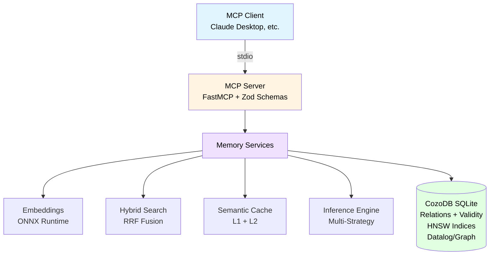

# CozoDB Memory MCP Server

[](https://www.npmjs.com/package/cozo-memory)
[](https://nodejs.org)
[](LICENSE)
[](https://lobehub.com/mcp/tobs-code-cozo-memory)

**Local-first memory for Claude & AI agents with hybrid search, Graph-RAG, and time-travel – all in a single binary, no cloud, no Docker.**

## Table of Contents

- [Quick Start](#quick-start)
- [Key Features](#key-features)
- [Positioning & Comparison](#positioning--comparison)
- [Installation](#installation)
- [Integration](#integration)
- [Documentation](#documentation)
- [Troubleshooting](#troubleshooting)

## Quick Start

### Option 1: Install via npm (Recommended)

```bash
# Install globally
npm install -g cozo-memory

# Or run directly with npx (no installation needed)
npx cozo-memory
```

### Option 2: Build from Source

```bash
git clone https://github.com/tobs-code/cozo-memory
cd cozo-memory
npm install && npm run build
npm run start
```

Now add the server to your MCP client (e.g. Claude Desktop) – see [Integration](#integration) below.

## Key Features

🔍 **Hybrid Search** - Combines semantic (HNSW), full-text (FTS), and graph signals via Reciprocal Rank Fusion for intelligent retrieval

🧠 **Agentic Retrieval** - Auto-routing engine analyzes query intent via local LLM to select optimal search strategy (Vector, Graph, or Community)

⏱️ **Time-Travel Queries** - Version all changes via CozoDB Validity; query any point in history with full audit trails

🎯 **GraphRAG-R1 Adaptive Retrieval** - Intelligent system with Progressive Retrieval Attenuation (PRA) and Cost-Aware F1 (CAF) scoring that learns from usage

⏳ **Temporal Conflict Resolution** - Automatic detection and resolution of contradictory observations with semantic analysis and audit preservation

🏠 **100% Local** - Embeddings via ONNX/Transformers; no external services, no cloud, complete data ownership

🧠 **Multi-Hop Reasoning** - Logic-aware graph traversal with vector pivots for deep relational reasoning

🗂️ **Hierarchical Memory** - Multi-level architecture (L0-L3) with intelligent compression and LLM-backed summarization

> **[→ See all features](docs/FEATURES.md)** | **[Version History](CHANGELOG.md)**

## Positioning & Comparison

Most "Memory" MCP servers fall into two categories:
1. **Simple Knowledge Graphs**: CRUD operations on triples, often only text search
2. **Pure Vector Stores**: Semantic search (RAG), but little understanding of complex relationships

This server fills the gap in between ("Sweet Spot"): A **local, database-backed memory engine** combining vector, graph, and keyword signals.

### Comparison with other solutions

| Feature | **CozoDB Memory (This Project)** | **Official Reference (`@modelcontextprotocol/server-memory`)** | **mcp-memory-service (Community)** | **Database Adapters (Qdrant/Neo4j)** |
| :--- | :--- | :--- | :--- | :--- |
| **Backend** | **CozoDB** (Graph + Vector + Relational) | JSON file (`memory.jsonl`) | SQLite / Cloudflare | Specialized DB (only Vector or Graph) |
| **Search Logic** | **Agentic (Auto-Route)**: Hybrid + Graph + Summaries | Keyword only / Exact Graph Match | Vector + Keyword | Mostly only one dimension |
| **Inference** | **Yes**: Built-in engine for implicit knowledge | No | No ("Dreaming" is consolidation) | No (Retrieval only) |
| **Community** | **Yes**: Hierarchical Community Summaries | No | No | Only clustering (no summary) |
| **Time-Travel** | **Yes**: Queries at any point in time (`Validity`) | No (current state only) | History available, no native DB feature | No |
| **Maintenance** | **Janitor**: LLM-backed cleanup | Manual | Automatic consolidation | Mostly manual |
| **Deployment** | **Local** (Node.js + Embedded DB) | Local (Docker/NPX) | Local or Cloud | Often requires external DB server |

The core advantage is **Intelligence and Traceability**: By combining an **Agentic Retrieval Layer** with **Hierarchical GraphRAG**, the system can answer both specific factual questions and broad thematic queries with much higher accuracy than pure vector stores.

## Installation

### Prerequisites

- Node.js 20+ (recommended)
- **RAM: 1.7 GB minimum** (for default bge-m3 model)
  - Model download: ~600 MB
  - Runtime memory: ~1.1 GB
  - For lower-spec machines, see [Embedding Model Options](#embedding-model-options) below
- CozoDB native dependency is installed via `cozo-node`

### Via npm (Easiest)

```bash
# Install globally
npm install -g cozo-memory

# Or use npx without installation
npx cozo-memory
```

### From Source

```bash
git clone https://github.com/tobs-code/cozo-memory
cd cozo-memory
npm install
npm run build
```

### Windows Quickstart

```bash
npm install
npm run build
npm run start
```

**Notes:**
- On first start, `@xenova/transformers` downloads the embedding model (may take time)
- Embeddings are processed on the CPU

### Embedding Model Options

CozoDB Memory supports multiple embedding models via the `EMBEDDING_MODEL` environment variable:

| Model | Size | RAM | Dimensions | Best For |
|-------|------|-----|------------|----------|
| `Xenova/bge-m3` (default) | ~600 MB | ~1.7 GB | 1024 | High accuracy, production use |
| `Xenova/all-MiniLM-L6-v2` | ~80 MB | ~400 MB | 384 | Low-spec machines, development |
| `Xenova/bge-small-en-v1.5` | ~130 MB | ~600 MB | 384 | Balanced performance |

**Configuration Options:**

**Option 1: Using `.env` file (Easiest for beginners)**

```bash
# Copy the example file
cp .env.example .env

# Edit .env and set your preferred model
EMBEDDING_MODEL=Xenova/all-MiniLM-L6-v2
```

**Option 2: MCP Server Config (For Claude Desktop / Kiro)**

```json
{
  "mcpServers": {
    "cozo-memory": {
      "command": "npx",
      "args": ["cozo-memory"],
      "env": {
        "EMBEDDING_MODEL": "Xenova/all-MiniLM-L6-v2"
      }
    }
  }
}
```

**Option 3: Command Line**

```bash
# Use lightweight model for development
EMBEDDING_MODEL=Xenova/all-MiniLM-L6-v2 npm run start
```

**Download Model First (Recommended):**

```bash
# Set model in .env or via command line, then:
EMBEDDING_MODEL=Xenova/all-MiniLM-L6-v2 npm run download-model
```

**Note:** Changing models requires re-embedding existing data. The model is downloaded once on first use.

## Integration

### Claude Desktop

#### Using npx (Recommended)

```json
{
  "mcpServers": {
    "cozo-memory": {
      "command": "npx",
      "args": ["cozo-memory"]
    }
  }
}
```

#### Using global installation

```json
{
  "mcpServers": {
    "cozo-memory": {
      "command": "cozo-memory"
    }
  }
}
```

#### Using local build

```json
{
  "mcpServers": {
    "cozo-memory": {
      "command": "node",
      "args": ["C:/Path/to/cozo-memory/dist/index.js"]
    }
  }
}
```

### Framework Adapters

Official adapters for seamless integration with popular AI frameworks:

**🦜 LangChain Adapter**

```bash
npm install @cozo-memory/langchain @cozo-memory/adapters-core
```

```typescript
import { CozoMemoryChatHistory, CozoMemoryRetriever } from '@cozo-memory/langchain';

const chatHistory = new CozoMemoryChatHistory({ sessionName: 'user-123' });
const retriever = new CozoMemoryRetriever({ useGraphRAG: true, graphRAGDepth: 2 });
```

**🦙 LlamaIndex Adapter**

```bash
npm install @cozo-memory/llamaindex @cozo-memory/adapters-core
```

```typescript
import { CozoVectorStore } from '@cozo-memory/llamaindex';

const vectorStore = new CozoVectorStore({ useGraphRAG: true });
```

**Documentation:** See [adapters/README.md](./adapters/README.md) for complete examples and API reference.

## CLI & TUI

### CLI Tool

Full-featured CLI for all operations:

```bash
# System operations
cozo-memory system health
cozo-memory system metrics

# Entity operations
cozo-memory entity create -n "MyEntity" -t "person"
cozo-memory entity get -i <entity-id>

# Search
cozo-memory search query -q "search term" -l 10
cozo-memory search agentic -q "agentic query"

# Graph operations
cozo-memory graph pagerank
cozo-memory graph communities

# Export/Import
cozo-memory export json -o backup.json
cozo-memory import file -i data.json -f cozo

# All commands support -f json or -f pretty for output formatting
```

> **See CLI help for complete command reference: `cozo-memory --help`**

### TUI (Terminal User Interface)

Interactive TUI with mouse support powered by Python Textual:

```bash
# Install Python dependencies (one-time)
pip install textual

# Launch TUI
npm run tui
# or directly:
cozo-memory-tui
```

**TUI Features:**
- 🖱️ Full mouse support (click buttons, scroll, select inputs)
- ⌨️ Keyboard shortcuts (q=quit, h=help, r=refresh)
- 📊 Interactive menus for all operations
- 🎨 Rich terminal UI with colors and animations

## Architecture Overview


```mermaid
graph TB
    Client[MCP Client<br/>Claude Desktop, etc.]
    Server[MCP Server<br/>FastMCP + Zod Schemas]
    Services[Memory Services]
    Embeddings[Embeddings<br/>ONNX Runtime]
    Search[Hybrid Search<br/>RRF Fusion]
    Cache[Semantic Cache<br/>L1 + L2]
    Inference[Inference Engine<br/>Multi-Strategy]
    DB[(CozoDB SQLite<br/>Relations + Validity<br/>HNSW Indices<br/>Datalog/Graph)]
    
    Client -->|stdio| Server
    Server --> Services
    Services --> Embeddings
    Services --> Search
    Services --> Cache
    Services --> Inference
    Services --> DB
    
    style Client fill:#e1f5ff,color:#000
    style Server fill:#fff4e1,color:#000
    style Services fill:#f0e1ff,color:#000
    style DB fill:#e1ffe1,color:#000
```

> **See [docs/ARCHITECTURE.md](docs/ARCHITECTURE.md) for detailed architecture documentation**

## MCP Tools Overview

The interface is reduced to **5 consolidated tools**:

| Tool | Purpose | Key Actions |
|------|---------|-------------|
| `mutate_memory` | Write operations | create_entity, update_entity, delete_entity, add_observation, create_relation, transactions, sessions, tasks |
| `query_memory` | Read operations | search, advancedSearch, context, graph_rag, graph_walking, agentic_search, adaptive_retrieval |
| `analyze_graph` | Graph analysis | explore, communities, pagerank, betweenness, hits, shortest_path, semantic_walk |
| `manage_system` | Maintenance | health, metrics, export, import, cleanup, defrag, reflect, snapshots |
| `edit_user_profile` | User preferences | Edit global user profile with preferences and work style |

> **See [docs/API.md](docs/API.md) for complete API reference with all parameters and examples**

## Troubleshooting

### Common Issues

**First Start Takes Long**
- The embedding model download takes 30-90 seconds on first start (Transformers loads ~500MB of artifacts)
- This is normal and only happens once
- Subsequent starts are fast (< 2 seconds)

**Cleanup/Reflect Requires Ollama**
- If using `cleanup` or `reflect` actions, an Ollama service must be running locally
- Install Ollama from https://ollama.ai
- Pull the desired model: `ollama pull demyagent-4b-i1:Q6_K` (or your preferred model)

**Windows-Specific**
- Embeddings are processed on CPU for maximum compatibility
- RocksDB backend requires Visual C++ Redistributable if using that option

**Performance Issues**
- First query after restart is slower (cold cache)
- Use `health` action to check cache hit rates
- Consider RocksDB backend for datasets > 100k entities

> **See [docs/BENCHMARKS.md](docs/BENCHMARKS.md) for performance optimization tips**

## Documentation

- **[docs/API.md](docs/API.md)** - Complete MCP tools reference with all parameters and examples
- **[docs/ARCHITECTURE.md](docs/ARCHITECTURE.md)** - System architecture, data model, and technical details
- **[docs/BENCHMARKS.md](docs/BENCHMARKS.md)** - Performance metrics, evaluation results, and optimization tips
- **[docs/FEATURES.md](docs/FEATURES.md)** - Detailed feature documentation with usage examples
- **[docs/USER-PROFILING.md](docs/USER-PROFILING.md)** - User preference profiling and personalization
- **[CHANGELOG.md](CHANGELOG.md)** - Version history and release notes
- **[CONTRIBUTING.md](CONTRIBUTING.md)** - Development guidelines

## Development

### Structure

- `src/index.ts`: MCP Server + Tool Registration
- `src/memory-service.ts`: Core business logic
- `src/db-service.ts`: Database operations
- `src/embedding-service.ts`: Embedding Pipeline + Cache
- `src/hybrid-search.ts`: Search Strategies + RRF
- `src/inference-engine.ts`: Inference Strategies
- `src/api_bridge.ts`: Express API Bridge (optional)

### Scripts

```bash
npm run build        # TypeScript Build
npm run dev          # ts-node Start of MCP Server
npm run start        # Starts dist/index.js (stdio)
npm run bridge       # Build + Start of API Bridge
npm run benchmark    # Runs performance tests
npm run eval         # Runs evaluation suite
```

## Roadmap

### Near-Term (v1.x)

- **GPU Acceleration** - CUDA support for embedding generation (10-50x faster)
- **Streaming Ingestion** - Real-time data ingestion from logs, APIs, webhooks
- **Advanced Chunking** - Semantic chunking for `ingest_file` (paragraph-aware splitting)
- **Query Optimization** - Automatic query plan optimization for complex graph traversals
- **Additional Export Formats** - Notion, Roam Research, Logseq compatibility

### Mid-Term (v2.x)

- **Multi-Modal Embeddings** - Support for images, audio, code
- **Distributed Memory** - Sharding and replication for large-scale deployments
- **Advanced Inference** - Neural-symbolic reasoning, causal inference
- **Real-Time Sync** - WebSocket-based real-time updates
- **Web UI** - Browser-based management interface

### Long-Term (v3.x)

- **Federated Learning** - Privacy-preserving collaborative learning
- **Quantum-Inspired Algorithms** - Advanced graph algorithms
- **Multi-Agent Coordination** - Shared memory across multiple agents

## Contributing

Contributions are welcome! Please see [CONTRIBUTING.md](CONTRIBUTING.md) for guidelines.

## License

Apache 2.0 - See [LICENSE](LICENSE) for details.

## Acknowledgments

Built with:
- [CozoDB](https://github.com/cozodb/cozo) - Embedded graph database
- [ONNX Runtime](https://onnxruntime.ai/) - Local embedding generation
- [Transformers.js](https://huggingface.co/docs/transformers.js) - Xenova/bge-m3 model
- [FastMCP](https://github.com/jlowin/fastmcp) - MCP server framework

Research foundations:
- GraphRAG-R1 (Yu et al., WWW 2026)
- HopRAG (ACL 2025)
- T-GRAG (Li et al., 2025)
- FEEG Framework (Samuel et al., 2026)
- Allan-Poe (arXiv:2511.00855)
