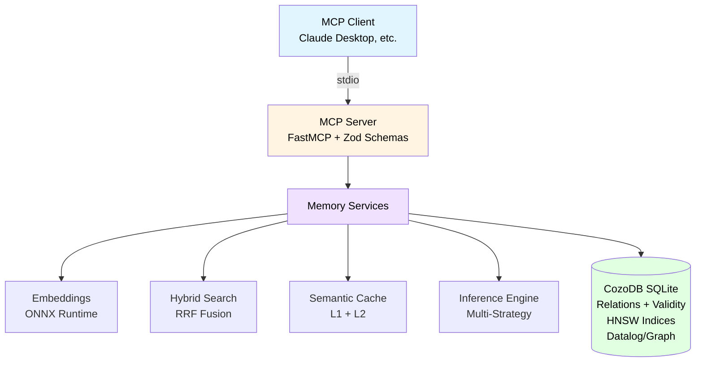
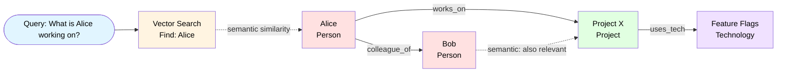

# Architecture

CozoDB Memory is built on a layered architecture combining graph, vector, and relational capabilities in a single embedded database.

## System Architecture



## Graph-Walking Visualization



## Data Model

CozoDB Relations (simplified) – all write operations create new `Validity` entries (Time-Travel):

- `entity`: `id`, `created_at: Validity` ⇒ `name`, `type`, `embedding(1024)`, `name_embedding(1024)`, `metadata(Json)`
- `observation`: `id`, `created_at: Validity` ⇒ `entity_id`, `text`, `embedding(1024)`, `metadata(Json)`
- `relationship`: `from_id`, `to_id`, `relation_type`, `created_at: Validity` ⇒ `strength(0..1)`, `metadata(Json)`
- `entity_community`: `entity_id` ⇒ `community_id` (Key-Value Mapping from LabelPropagation)
- `memory_snapshot`: `snapshot_id` ⇒ Counts + `metadata` + `created_at(Int)`

### Entity Schema

Entities are the core knowledge nodes in the system:

- **id**: Unique identifier (UUID)
- **name**: Human-readable name
- **type**: Entity type (Person, Project, Concept, etc.)
- **embedding**: 1024-dimensional content embedding (semantic context)
- **name_embedding**: 1024-dimensional name embedding (identification)
- **metadata**: JSON object for custom attributes
- **created_at**: Validity timestamp for time-travel queries

### Observation Schema

Observations are facts or notes attached to entities:

- **id**: Unique identifier (UUID)
- **entity_id**: Reference to parent entity
- **text**: Observation content
- **embedding**: 1024-dimensional semantic embedding
- **metadata**: JSON object for custom attributes
- **created_at**: Validity timestamp

### Relationship Schema

Relationships connect entities in the knowledge graph:

- **from_id**: Source entity ID
- **to_id**: Target entity ID
- **relation_type**: Type of relationship (works_on, knows, related_to, etc.)
- **strength**: Confidence score (0.0-1.0)
- **metadata**: JSON object for custom attributes
- **created_at**: Validity timestamp

## Service Layer

### Memory Service (`src/memory-service.ts`)

Core business logic for entity/observation/relationship management:

- Entity CRUD operations
- Observation management with deduplication
- Relationship creation and validation
- Transaction support
- Session and task management

### Hybrid Search (`src/hybrid-search.ts`)

Multi-path retrieval combining:

- **Vector Search**: HNSW indices for semantic similarity
- **Keyword Search**: Regex-based text matching
- **Full-Text Search**: BM25 scoring
- **Graph Signals**: PageRank, community expansion
- **Inference**: Probabilistic relationship discovery

Fusion via Reciprocal Rank Fusion (RRF) with temporal decay.

### Embedding Service (`src/embedding-service.ts`)

Local embedding generation with caching:

- **Model**: Xenova/bge-m3 (1024 dimensions) via ONNX Runtime
- **Cache**: LRU cache (1000 entries, 1h TTL)
- **Processing**: CPU-based for maximum compatibility
- **Fallback**: Zero vector on errors

### Inference Engine (`src/inference-engine.ts`)

Implicit knowledge discovery:

- **Co-occurrence**: Entity names in observation texts
- **Semantic Proximity**: Similar entities via HNSW
- **Transitivity**: A→B and B→C implies A→C
- **Expertise Rules**: Person + works_on + uses_tech
- **Custom Rules**: User-defined Datalog inference rules

### Database Service (`src/db-service.ts`)

CozoDB query execution and schema management:

- Datalog query execution
- Schema initialization
- Validity-based time-travel
- Transaction support
- Index management (HNSW, FTS, LSH)

## Technical Highlights

### Local ONNX Embeddings

- Default Model: `Xenova/bge-m3` (1024 dimensions)
- CPU-based processing for maximum compatibility
- LRU cache (1000 entries, 1h TTL)
- Graceful fallback to zero vector on errors

### Hybrid Search with RRF

Combines multiple signals:
- Vector similarity (HNSW indices)
- Keyword matching (Regex)
- Graph signals (PageRank)
- Community expansion
- Inference engine

Fusion via Reciprocal Rank Fusion (RRF) with temporal decay (90-day half-life).

### Cross-Encoder Reranker

- Model: `Xenova/ms-marco-MiniLM-L-6-v2` (Local ONNX)
- Re-evaluates top candidates for maximum precision
- Minimal overhead (~4-6ms for top 10)
- Available via `rerank: true` parameter

### Dual Timestamp Format

All operations return timestamps in both formats:
- `created_at`: Unix microseconds (for calculations)
- `created_at_iso`: ISO 8601 string (human-readable)

### Time-Travel Queries

CozoDB Validity enables querying any point in history:

```typescript
// Query entity state at specific time
{ "action": "entity_details", "entity_id": "ID", "as_of": "2026-01-15T10:00:00Z" }

// Query relationship evolution
{ "action": "get_relation_evolution", "from_id": "ID1", "to_id": "ID2" }
```

## Development Structure

- `src/index.ts`: MCP Server + Tool Registration + Schema Setup
- `src/memory-service.ts`: Core business logic
- `src/db-service.ts`: Database operations
- `src/embedding-service.ts`: Embedding Pipeline + LRU Cache
- `src/hybrid-search.ts`: Search Strategies + RRF + Community Expansion
- `src/inference-engine.ts`: Inference Strategies
- `src/reranker-service.ts`: Cross-Encoder reranking
- `src/export-import-service.ts`: Data portability
- `src/api_bridge.ts`: Express API Bridge (optional)

## Configuration & Backends

The system supports various storage backends. **SQLite** is used by default.

### Backend Options

| Backend | Status | Recommendation |
| :--- | :--- | :--- |
| **SQLite** | Active (Default) | Standard for desktop/local usage |
| **RocksDB** | Prepared & Tested | For high-performance or very large datasets |
| **MDBX** | Not supported | Requires manual build of `cozo-node` from source |

### Changing Backend

Set the `DB_ENGINE` environment variable:

**PowerShell:**
```powershell
$env:DB_ENGINE="rocksdb"; npm run dev
```

**Bash:**
```bash
DB_ENGINE=rocksdb npm run dev
```

### Environment Variables

| Variable | Default | Description |
|----------|---------|-------------|
| `DB_ENGINE` | `sqlite` | Database backend: `sqlite` or `rocksdb` |
| `EMBEDDING_MODEL` | `Xenova/bge-m3` | Embedding model |
| `PORT` | `3001` | HTTP API bridge port |

## See Also

- [API Reference](API.md) - Complete MCP tools documentation
- [Benchmarks](BENCHMARKS.md) - Performance metrics and evaluation
- [User Profiling](USER-PROFILING.md) - Preference management
- [Features](FEATURES.md) - Detailed feature documentation
